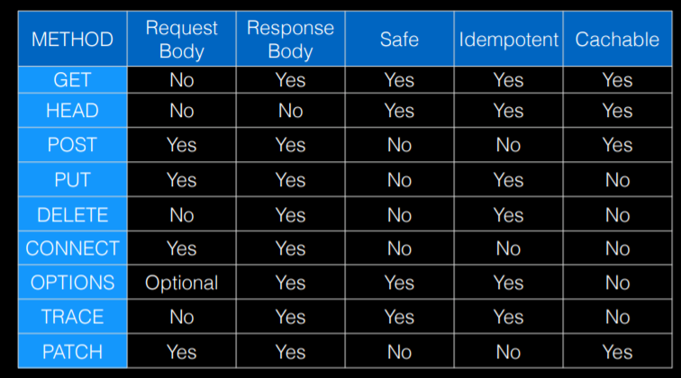
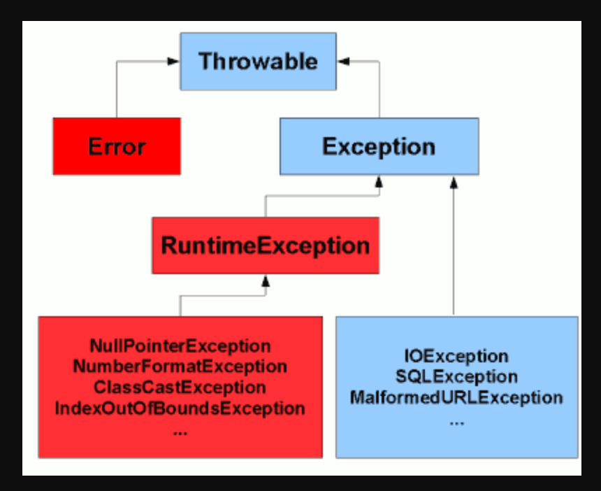

1. What is difference between JDK, JRE and JVM
2. What is synchronization?  is a process which keeps all concurrent threads in execution to be in sync. multiple threads are going to access the same object. you will be able to acquire the lock on your objects. one after another.
3. What are the differences between processes and threads?
An executing instance of a program is called a process. A thread is a subset of the process. process is controlled by the operating system, Threads are controlled by programmer in a program.
4. What are Wrapper classes?
Each of java's eight primitive data types has a class dedicated to it. These are known as wrapper classes because they "wrap" the primitive data type into an object of that class. we boxing primitive data types so we can pass the variables by reference.
5. What purpose does the keywords final, finally and finalize?
Final is used to apply restrictions on class, method and variable. final class can't be inherited.Final method can't be overwritten. Final variable value can't be changed.
Finally is used to place important code, it will be executed whether exception is handled or not.
Finalize is kind of a destructor , used to perform clean up processing just before objec is garbage collected. If you want to do anything before your object is removed from the memory, you can write it into the finalize method.
6. What is the different between StringBuffer and StringBuilder?
    They are both mutable version. String is immutable.
    StringBuffer operations are thread-safe and synchronized where StringBuilder operations are not thread-safe. so StringBuffer is to be used when multiple threads are working on same String. StringBuilder in the single threaded environment.
7. What are the differences between Heap and Stack Memory?
   2 memories.  PPP  ref = new PPP();   ref is in stack is the address of the ppp,   ppp is in heap.
   anything for which you use the "new" operator that will be constructed heap
    every object is dynamically constructed in heap.
8. What is the difference between HashMap and HashTable?
   HashMap is non synchronized and are not thread safe. HashTable is thread safe.
9. What is the difference between equals() and == operator?
    Equals() is a method defined in Object class in java and used for checking equality of 2 objects defined by business logic.
    "==" or equality operator  in java is a operator provided by Java programming language and used to compare primitives and objects.
10. What is the difference between abstract classed and interfaces?
    a class may extend one abstract class, but can implement several interfaces.
    abstract class can have non-abstract methods. 
11. What is Polymorphism?
    Polymorphis is briefly described as "one interface, many implementations"
12. What is the difference between method overloading and method overriding?
    overloaded method is methods of the same class shares the same name but ech method must have different number of parameters ofr parameters having different types and order.
    Overridden 
13. What is the multiple inheritance and does java support?
    do not support.
14. what is a Servlet?
    Java Servlet is server side technologies.
    Servlet is a java program which is executed over the server
15. What is difference between Get and Post method?
    Limited amount of data can be sent because data is sent in header.  Large amount of data can be sent because data is sent in body.
16. What are different methods of session management in servlets?
    session is a conversational state between client and server and it can consistes of multiple request and response between client and server.
 17. What is JDBC driver?
     JDBC Driver is a software component that enables java applicatin to interact with the database. 

18.  What is Spring?
    It is an framework of frameworks
19. What are the different dodules of the spring famework?
    MVC : model represents data container     view: represents the UI and the presentation   controller represents a businesslogic 
20. List some of the important nnotations in annotation-based Spring configuration.
    @Required @Autoried @Resource @RequestMapping @Configuration

21. What is a Bean in Spring and Explain the different scopes of bean in Spring.
    A bean is an object that is managed by a spring ioc container.
    prototype scope : every time i am requseting the objects of benn form the spring container it is construct a new object and returning it back.   singleton scope : you are able to receive the reference to the same object.
多态 polymorphism: reference belong to the parents but object belong to the child.
22. What is autowiring in spring? What are the autowiring modes?
    Autowiring enables the programmer to inject the bean automatically. We do not need to write explicit injection logic.
23. What is Hibernate Framework?
    Hibernate paovides framework for mapping application domain objects to relational database tables and vice versa.
24. A class is a blueprint which you use to create objects. An object is an instance of a class.
25. Ioc    Private protect public 
26. singleton  we can have only one object of that class at one time
27. that a "Bean" is a Java class with properties and getters/setters. 
28. java pojo: This class can be used by any Java program as it's not tied to any framework.


xmlns:th="http://www.thymeleaf.org"

**cosmic :** (adj) 宇宙的

**back ticks :** 反引号

**bootstraps :** 引导程序；辅助程序；

**NPV :** Net Present Value  净现值法

**velocity :** 速度

**dispathcer:** 调度员；调度程序；分配器；

**validation** （n）确认；批准；生效；

**apradigm** (n) 范例；词形变化表；

**opinionaeted** (adj) 固执己见的；武断的；


___
**JSON ：** javascript object notaion

**Thymeleaf:** templating engine (百里香叶子)

**MVC:** Model view controller

**JPA  :** Java Persistence API

**API :** application programing interface 电脑需要调用手机里面的信息，这时候你会拿一根数据线将电脑手机连接起来，电脑和手机上连接数据线的接口就是传说中的API接口。“应用程序编程接口”。是一些预先定义的函数，目的是提供应用程序与开发人员基于某软件或硬件得以访问一组例程的能力，而又无需访问源码，或理解内部工作机制的细节。

**POJOs :** plain ordinary java objects

**ORM :** object relational mapping tool

**servlet:** 小程序；伺服程序；

**AOP:** Aspect oriented programming framework

**JSP:** Java Server Page  (一种建立动态网页的技术 包括 Thymeleaf)

**TDD:** Test-Driven Development

**CI：** Continuous Intergration

**maven wrapper:** THis allows us to run Maven from the command line.

**JIRA:** issue trackers. what the issue tarcker does is provide visibility of this source code was changing. It provides a record of why it's changing. and also you business partners can see through the issue tracker what the issue was, the history of it, and where the source code changed so that rather just short commit messages.


### Section 2
**constructor :** 空constructor可以把所有值设定为默认值建立object. 如果没写constructor， 那么系统会自动提供一个空constructor， 但是如果有constructor，那么就是能再写一个空的。

**List :** is an ordered collection which allows duplicates while "set" is an unordered collection which does not allow duplicates.

* JPA entities you need to put them in a package called domain or model.(Author; Book)
* JPA require a zero args constructor.

> **JPA annotations**
* **@entity**  tells Hibernate that this is an entity
* **@ID**
* **@GeneratedValue(strategy = GenerationTye.auto)**   database is going to be providing the    generation of this
* **@component** tells the Spring Framework to detect this as a Spring managed component.
* **@Controller**
* **@RequesMapping(URL)**
* **@AutoWried**// This tells spring that i want it to go ahead and inject an instance
* **@Qualifier**
* **Primary**
* **Profile**

**@Component @Service @Controller** these are no different to Spring. Tell spring this is a Spring managed component.
                                    There are just show you how that it's going to be utilized.  


>***Different between equals() and "=="***
1. Main difference between .equals() method and == operator is that one is method and other is operator.
2. We can use == operators for reference comparison (address comparison) and .equals() method for content comparison. In simple words, == checks if both objects point to the same memory location whereas .equals() evaluates to the comparison of values in the objects.
3. If a class does not override the equals method, then by default it uses equals(Object o) method of the closest
 parent class that has overridden this method

 [Java hashCode() 和 equals() 问题的解答, 只要建立hash table 就一定要同时重写这俩方法](https://www.cnblogs.com/skywang12345/p/3324958.html)

**Repositories :** is a pattern where you have a repository object that is responsible for your Persistence and query operation.  
extends “CrudRepository<T,Id>”;

**ComandLineRunner:** is a interface to tell Spring to look for instances of this type and to find some that is going to go head and run them.  

**Spring Data** is a family of project.it implements a repository pattern.**Spring Date JPA** is make to work with Hibemate.

>**查看H2数据库表格**
* **localhost:8080/h2-console/**
* **spring.h2.console.enabled=true** 在Itellij 里面properties, 打开console
*  **jdbc:h2:mem:testdb**

---

## Spring MVC

>**MVC:**
**client** <---> **controller** <--->* **Model**
                                      &  **View**
* **Client :** it is a wb application or a mobile application or some type of device like a client.
* **Contorler :** is traffic cop. It should be deciding how to get the model and who to ask the model from. Return the **model** to the **view**.
**Keep Controller Light**
* **Model:** is POJO. Data Structure. should not contain any logic in it.

**Thymeleaf**(templating engine) is going to take **model**(POJO) and look at our template and generate the HTML to return back to the client.

---

 Classic Java servlet Architechure

request comes in, dispatch or sevlet, looks up the handler mapping, invokes the controller method which in a spring context is going to go call service get the data, return the model, and then the model is going to get passed off to a templating engine for us in this case Thymeleaf and then that HTML is going to get rendered back to the client.

**configure Spring MVC controller：** associate a controller method with a request path.
* Annotate Controller Class with **@Controller**
  * This will register the class as Spring Bean and as a Contorler in Spring MVC
* To map method to http request paths use **@RequesMapping**

>**Petclinic:** Sample application designed to show how the Spring Application frameworks can be used to build simple, but powerful database-oriented applications.
* **JavaBeans** to configura things using inversion of Control(loC)
* **Spring MVC** for the presentation layer.
* **JDBC** & **Java Persistence API** & **Spring Data JPA** to set up a database
* **JMX** application monitoring
* **AOP** Declarative Transaction Management using AOP

>**Opinionated Design**
* **Opinionated** -is a kind of a loose concept in the software industry. Opinionated means there is one way of doing things. It's a particular persons or groups opinion.
* **Un-Opinionated** -You can do things anyway you want.
* **Spring Boot** - is a configuration wrapper around the Spring framework. It gives you a lot of activity tools. Bring a number of "Opinionated" default configurations. Using Spring Boot is following an Opinionated design.

* **SCM** Source Code Management

---

##  Section 3 : Dependency injection with Spring  

**生词：**

**brittle :**   脆的；

**segregation :** (n) 隔离；分离；种族隔离；

**solder :**(n) 焊料；接合物；（v）焊接；

**inversion :**(n) 倒置；反向；倒转；

**coupling :** (n)耦合；

**bolated :** (V)膨胀；

**cohesive :** (adj)凝聚的；有结合力的；紧密结合的；

**versatility :**(n) 多功能性；多才多艺；用途广泛；

**rebase :**(v) 重定基准

**Crud :** 增删查改


___
**dependency injection** and **inversion control** is the cornerstone of Spring Framework.

>**S.O.L.I.D Principle of OOP:**
* **Single Responsibility Principle:**
    * Every Class should have a single Responsibility
    * There should never be more than one reason for a clss to change.
    * Classes should be small. No more than a screen full of code.
    * Avoid 'god' classes.
    * Split big classes into smaller classes.
* **Open Closed Principle:**
   * Your classes Open for extension but closed for modification.
   * You should be able to exentd a classes behavior, without modifying it.
   * Use private variables with getters and setters - ONLY when you need them
   * Use abstract base classes.
* **LISKOV Substitutiion Principle:**
  * Objects in a program would be replaceable with instances instances of their subtypes WITHOUT altering the correctness of the program.
  * A Square "Is a" Rectangele, a Rectangle "Is NOt" a Square、
* **interface segregation Principle:**
 * Make fine grained interfaces that are client specific
 * Many client specific interfaces are better than one "general prupose"
 interface.
 * Keep your components focused and minimize dependencies between them
 * Notice relationship to the Single Responsibility Principle?
   * ie: avoid 'god' interfaces
* **Dependency Inversion Principle**
  * Abstractions should not depend upon details
  * Details should depend upon abstractiosns
  * Important that higher level and lower levle objects depend on the same abstract interraction
  * This is not the same as Dependency Injection - which is how objects obtain dependent objects.

  **Artifact** name usually match to the repository Name.

  **box type vs primitive** (Long vs long)boxtypes can be null but primitive can't. Hibernate recommend box Types.

  ```java
     MyController aa = (MyController) ctx.getBean("myController");

  ```

[Basic of Depency injection](BasicsOfDI.v   @Override
    public PetType parse(String text, Locale locale) throws ParseException {
        return ;
    })
所有的 constroller service  都加标注  @Controller @Service @AutoWried @Primary @Profile
>**Types of Dependency Injection**
* **By class properties** never use
* **By Setters**
* **By Constructor :** Most preferred   Optional "@AutoWried" 不必写

**Inversion of Control :** the runtime environment (or framework) injects dependency

>**Release vs Snapshot**
A "release" is the final build for a version which does not change. A "snapshot" is a build which can be replaced by another build which has the same name. It implies that the build could change at any time and is still under active development. You have different artifacts for different builds based on the same code

>**artifact**
An artifact is a file, usually a JAR, that gets deployed to a Maven repository. A Maven build produces one or more artifacts, such as a compiled JAR and a "sources" JAR. Each artifact has a group ID (usually a reversed domain name, like com. example. foo), an artifact ID (just a name), and a version string

**About maven Release**
1. porm.xml 配置文件
```java
   <build>
        <plugins>
            <plugin>
                <groupId>org.springframework.boot</groupId>
                <artifactId>spring-boot-maven-plugin</artifactId>
            </plugin>
            <plugin>
                <groupId>org.apache.maven.plugins</groupId>
                <artifactId>maven-release-plugin</artifactId>
                <version>2.5.3</version>
                <configuration>
                    <goals>install</goals>
                    <autoVersionSubmodules>true</autoVersionSubmodules>
                </configuration>
            </plugin>

        </plugins>
    </build>


 <scm>
     <developerConnection>scm:git:https://github.com/lxian-coder/pet-clinic.git</developerConnection>
  </scm>

```
2. 进行 prepare 和 perform   当perfrom 完成以后，形成了新release的同时，也完成了master的push.
   ```intellij terminal
      mvn release:prepare
      mve replease:perform
   ```

3. prepare 完成但是想修改回滚
```intellij terminal
mvn release:rollback
git tag   查看本地库的tag
git tag -d delete myTag   删除本地库tag
git push -d origin mytag   删除远程库tag

```
4. 遇到问题  tag has aready exits
```intellij terminal

   git tag   查看本地库的tag
   git tag -d delete myTag   删除本地库tag
   git push -d origin mytag   删除远程库tag

```

**interface 中的方法都自动是public   中的变量必须申明 public static final**

>**关于public protect private default 的说明**

 1.对于public修饰符，它具有最大的访问权限，可以访问任何一个在CLASSPATH下的类，接口，异常等。它往往 对于对外的情况，也就是对象或类对外的一种接口的形式。

2.对于protected修饰符，它主要的作用就是用来保护子类的。它的含义在于子类可以使用它修饰的成员，其他的不可以，它相当于传递给子类的一种继承的东西。

3.对于default来说，有的时候也称为friendly（友员），它是针对本包访问而设计的，任何处于本包下的类，接口，异常等，都可以互相访问，即使是父类没有用protected修饰的成员也可以。

4.对于private来说，它的访问权限仅限于类的内部，是一种封装的体现，例如，大多数的成员变量都是修饰为private的，它们不希望被其他任何外部的类访问

>**集合 的体系**

------------| Collection 单例集合的根接口

----------------| List  如果是实现了List接口的集合类，具备的特点： 有序，可重复。 

-------------------| ArrayList  ArrayList 底层是维护了一个Object数组实现的。 特点： 查询速度快，增删慢。

-------------------| LinkedList LinkedList 底层是使用了链表数据结构实现的， 特点： 查询速度慢，增删快。

-------------------| Vector(了解即可)  底层也是维护了一个Object的数组实现的，实现与ArrayList是一样的，但是Vector是线程安全的，操作效率低。


----------------| Set  如果是实现了Set接口的集合类，具备的特点： 无序，不可重复。

-------------------| HashSet  底层是使用了哈希表来支持的，特点： 存取速度快. 

-------------------| TreeSet   如果元素具备自然顺序 的特性，那么就按照元素自然顺序的特性进行排序存储

Iterable<t> --> Collection<E>  --> Set<E>  
Iterable<t> --> Collection<E>  --> List<E>

HashMap() / TreeMap() implemint map<K,v>

>**Java HashMap creation :**
 HashMap is created with new keyword.
```java
Map<String, String> capitals = new HashMap<>();
```
We specify the types of keys and values between angle brackets. Thanks to type inference, it is not necessary to provide types on the right side of the declaration


>**Java中，一个类实现某个接口，必须重写接口中的所有方法吗**

“Java中，一个类实现了某接口，则必须实现该接口中的所有方法么？”这句话其实是不准确的，因为我们还没有考虑到抽象类。

抽象类实现某个接口，可以不实现所有接口的方法，可以由它的子类实现。而普通类即非抽象类则必须实现接口里的全部方法。

同样地，再来讲述一下接口：

1 接口的设计解决了java只能单继承的缺点，可以实现多个接口来实现java的多继承。
2 实现某个接口必须覆写其中的所有方法，当然也可以是一个空的实现（方法体为空没有任何作用），但是这个类必须是非抽象类，抽象类如上文

**关于抽象方法和抽象类**
在讲抽象类之前有必要强调一下abstract修饰符：

     1.abstract修饰的类为抽象类，此类不能有对象，（无法对此类进行实例化，说白了就是不能new）；

     2.abstract修饰的方法为抽象方法，此方法不能有方法体（就是什么内容不能有）；

关于抽象类的使用特点：

    1.抽象类不能有对象，（不能用new此关键字来创建抽象类的对象）；

    2.有抽象方法的类一定是抽象类，但是抽象类中不一定有抽象方法；

    3.抽象类中的抽象方法必须在子类中被重写。

同学们可能会问到：抽象类不能被“new”，抽象方法必须重写，那么定义它们做什么嘞？

       答：抽象类生来就注定它是要被继承的，如果没有任何一个类去继承它的话，那么也就失去了它的意义；抽象方法生来就是要被重写的，而且是必须重写。（只要继承了某个抽象类，就必须去重写此抽象类中含有的抽象方法)

**抽象类实现接口的意义**

一般来说，普通类来实现接口，这个普通类就必须实现接口中的所有方法，这样的结果就是普通类中需要实现多余的方法，造成代码冗余。但如果我们使用抽象类来实现接口，那么就可以只实现接口中的部分方法，并且当其他类来继承这个抽象类时，可以随意选择实现还是不实现接口中的方法。
特别注意: 在实际测试中发现当有其他类来继承这个抽象类的时候,仍然要实现接口的全部功能;

**没有抽象方法的抽象类的使用意义**
1. 抽象方法是不能被实例化的，没有抽象方法的抽象类的价值在于:实例化了没有意义，因为类已经把方法都实现了，而且它不需要通过不同的对象来保存不同的状态。
这种场景更多的出现在各种工具类中，如果它的所有方法都是静态的，那么把它定义为抽象的，会从机制上防止实例化
1. 抽象方法实现接口。这样保证子类更加自由选择实现接口中的方法。

***

## Section 5 Spring Framework Configuration


 **new concept and new words :**
 * **POM :** A Project Object Model or POM is the fundamental unit of work in Maven. It is an XML file that contains information about the project and configuration details used by Maven to build the project. It contains default values for most projects.
 * **IoC :** Inversion of Control;控制反转；


>**Spring Configuration Options**
1. XML Based configuration
1. Annotation Based configuration
   * @Controller @Servie @Component @Repository
1. Java Based configuration      
 * Uses Java Classes to define Spring Beans
 * Configuration classes are defined with  @Configuration
 * Beans are declared with @Bean
1. Groovy Bean Definition DSL configuration   
   * DSL: domain-specific language
   * Allows you to declare beans in Groovy

Read more [SpringStereoTypes](.\SpringStereoTypes.pdf)

>**Component Scaning :**
 Spring boot is going to looking for classes that have been annotated with Spring annotations that to declare them either as a Configuration, a java Configuration,or in our case, what we're looking at is Beans that we declaredthrough the annotations for @Services and @Controllers and @Repositories....
Spring is going to look at specific packagesf but it does not scan the world.

>**72 component scan**

```java
@SpringBootApplication
@ComponentScan(basePackages = {"services", "guru.springframework"})
public class DiDemoApplication {
```

**73 java configuration**
```java
@Configuration
public class ChuckConfig {

    @Bean
    public ChuckNorrisQuotes chuckNorrisQuotes(){
        return new ChuckNorrisQuotes() ;
    }
}


 关于Bean factory
@Configuration
public class GreetingServiceConfig {

    @Bean
    GreetingServiceFactory greetingServiceFactory(GreetingRepository greetingRepository){
        return new GreetingServiceFactory(greetingRepository);
    }

    @Bean
    @Primary
    @Profile({"en","default"})
    GreetingService primaryGreetingService(GreetingServiceFactory greetingServiceFactory){
        return greetingServiceFactory.createGreetingService("en");
    }

    @Bean
    @Profile({"es"})
    @Primary
    GreetingService primaryGermanGreetingService(GreetingServiceFactory greetingServiceFactory){
        return greetingServiceFactory.createGreetingService("es");
    }

    @Bean
    @Primary
    @Profile("de")
    GreetingService primarySpanishGreetingService(GreetingServiceFactory greetingServiceFactory){
        return greetingServiceFactory.createGreetingService("de");
    }

    @Bean
    @Primary
    @Profile("de")
    GreetingService PrimarySpanishGreetingService(GreetingRepository greetingRepository){
        return new PrimarySpanishGreetingService(greetingRepository);
    }
}

```

**关于git 的复制问题 :** 如果在电脑上复制一个文件，这个文件的本地库也被复制了一个，和源文件不是一个本地库。

**resources :** stroe any textual types of resources or images or whatever we want to include in our jar or deployment artifact.  (XML)

**74 XMLconfiguration :**

                Application:     @ImportResource("classpath:chuck-config.xml")
                .xml       :     <bean name="ChuckNorrisQuotes" class="guru.springframework.norris.chuck.ChuckNorrisQuotes"/>


**关于@primary :** 如果同时有好几个primary，@Profile（{"aaa","default"}） 带有这个default的优先。而且如果是多个BEAN带有@Primary, 那么只要带有@Primary  必须带有@Profile 进行区分，即便不是“default” 也必须有@Profile

**关于@Service("1") :** 一但设立了“1”， 那么在Controller中, @Qualifier("   ") 就只能是1， class的名字就无法进行识别了。
**ReadMore 76SpringBootConfiguration.pdf**

**Spring Boot Annotations :** @SpringBootApplication includes
@Configuration  @EnableAutoConfiguration @ComponentScan

**Spring Bean Scopes (Read More 78SpringBeanScope)**


>**关于序列化 serializable接口的问题**

Serializable接口是一个里面什么都没有的接口
它的源代码是public interface Serializable{}，即什么都没有。
Serializable接口中没有任何方法，一个类实现这个接口只是表明这个类已经被序列化了

如果一个接口里面什么内容都没有，那么这个接口是一个标识接口，比如，一个学生遇到一个问题，排错排了几天也没解决，此时，她举手了（示意我去帮他解决），然后我过去，帮他解决了，那么这个举手其实就是一个标识，自己不能解决的问题标示我去帮他解决，在Java中的这个Serializable接口是给JVM看的，告诉JVM，我不做这个类的序列化了，你(JVM)给我序列化，序列化就是变成二进制流，比如云计算、Hadoop，特别是Hadoop完全就是分布式环境，那么就要涉及到对象要在网络中传输，里面的全是二进制流，当然你来做这个序列化操作也可以，但是这个类里面可能还有一个类，如果你把外面的类对象Person变成二进制，那么里面也要序列化（这要用到深度遍历，很麻烦），干脆告诉JVM，让他来帮你做。
serializable接口就是Java提供用来进行高效率的异地共享实例对象的机制，实现这个接口即可。

Serializable （序列化）
public interface Serializable 
类通过实现 java.io.Serializable 接口以启用其序列化功能。未实现此接口的类将无法使其任何状态序列化或反序列化。可序列化类的所有子类型本身都是可序列化的。序列化接口没有方法或字段，仅用于标识可序列化的语义。

一、什么是序列化

    Java平台允许我们在内存中创建可复用的Java对象，但一般情况下，只有当JVM处于运行时，这些对象才可能存在，即，这些对象的生命周期不会比JVM的生命周期更长。但在现实应用中，就可能要求在JVM停止运行之后能够保存(持久化)指定的对象，并在将来重新读取被保存的对象。Java对象序列化就能够帮助我们实现该功能。

    序列化就是为了保存在内存中的各种对象的状态（也就是实例变量，不是方法），并且可以把保存的对象状态再读出来。虽然你可以用你自己的各种各样的方法来保存object states，但是Java给你提供一种应该比你自己好的保存对象状态的机制，那就是序列化。

二、序列化的特点

    如果某个类能够被序列化，其子类也可以被序列化。声明为static和transient类型的成员数据不能被序列化。因为static代表类的状态， transient代表对象的临时数据。

三、如何实现序列化

    将需要序列化的类实现Serializable接口就可以了，Serializable接口中没有任何方法，可以理解为一个标记，即表明这个类可以序列化。

四、什么时候需要序列化

1:当你想把的内存中的对象状态保存到一个文件中或者数据库中时候
2:当你想用套接字在网络上传送对象的时候
3:当你想通过RMI传输对象的时候

    java对象序列化不仅保留一个对象的数据，而且递归保存对象引用的每个对象的数据。可以将整个对象层次写入字节流中，可以保存在文件中或在网络连接上传递。利用对象序列化可以进行对象的"深复制"，即复制对象本身及引用的对象本身。序列化一个对象可能得到整个对象序列。 

五、默认序列化机制

    如果仅仅只是让某个类实现Serializable接口，而没有其它任何处理的话，则就是使用默认序列化机制。使用默认机制，在序列化对象时，不仅会序列化当前对象本身，还会对该对象引用的其它对象也进行序列化，同样地，这些其它对象引用的另外对象也将被序列化，以此类推。所以，如果一个对象包含的成员变量是容器类对象，而这些容器所含有的元素也是容器类对象，那么这个序列化的过程就会较复杂，开销也较大。

六、serialVersionUID 版本号

    序列化运行时使用一个称为 serialVersionUID 的版本号与每个可序列化类相关联，该序列号在反序列化过程中用于验证序列化对象的发送者和接收者是否为该对象加载了与序列化兼容的类。如果接收者加载的该对象的类的 serialVersionUID 与对应的发送者的类的版本号不同，则反序列化将会导致 InvalidClassException。可序列化类可以通过声明名为 "serialVersionUID" 的字段（该字段必须是静态 (static)、最终 (final) 的 long 型字段）显式声明其自己的 serialVersionUID： 
ANY-ACCESS-MODIFIER static final long serialVersionUID = 42L; 
    如果可序列化类未显式声明 serialVersionUID，则序列化运行时将基于该类的各个方面计算该类的默认 serialVersionUID 值，如“Java(TM) 对象序列化规范”中所述。不过，强烈建议 所有可序列化类都显式声明 serialVersionUID 值，原因计算默认的 serialVersionUID 对类的详细信息具有较高的敏感性，根据编译器实现的不同可能千差万别，这样在反序列化过程中可能会导致意外的 InvalidClassException。因此，为保证 serialVersionUID 值跨不同 java 编译器实现的一致性，序列化类必须声明一个明确的 serialVersionUID 值。还强烈建议使用 private 修改器显示声明 serialVersionUID（如果可能），原因是这种声明仅应用于立即声明类 -- serialVersionUID 字段作为继承成员没有用处。 

关于Serializable的serialVersionUID：http://blog.csdn.net/smcwwh/article/details/8787561

七、相关注意事项
1:序列化时，只对对象的状态进行保存，而不管对象的方法。
2:当一个父类实现序列化，子类自动实现序列化，不需要显式实现Serializable接口。
3:当一个对象的实例变量引用其他对象，序列化该对象时也把引用对象进行序列化。
4:并非所有的对象都可以序列化，,至于为什么不可以，有很多原因了,比如：
    (1)安全方面的原因，比如一个对象拥有private，public等，对于一个要传输的对象，比如写到文件，或者进行rmi传输等等，在序列化进行传输的过程中，这个对象的private等域是不受保护的。
    (2)资源分配方面的原因，比如socket，thread类，如果可以序列化，进行传输或者保存，也无法对他们进行重新的资源分配。

简而言之：序列化的作用就是为了不同jvm之间共享实例对象的一种解决方案


**关于HTML**

注释快捷键 ctrl + "/"
```HTML
要注意是两个引号才可以 因为里面有空格；
<h1 th:text="'My Recipes'">MY Recipe</h1>
```
```html
<!DOCTYPE html>
<html lang="en" xmlns:th="http://www.thymeleaf.org">
<head>
    <meta charset="UTF-8">
    <title>Owners List</title>
</head>
<body>
    <h1 th:text="'Owners List'"></h1>
<table>
    <thead>
    <tr>
        <th>ID</th>
        <th>FirstName</th>
        <th>LastName</th>
    </tr>
    </thead>
    <tbody>

    <tr th:each="owner : ${owners}">
        <td th:text="${owner?.id}"></td>
        <td th:text="${owner?.firstName}"></td>
        <td th:text="${owner?.lastName}"></td>
    </tr>
    </tbody>
</table>
</body>
</html>
```
The \<tr> tag defines a row in an HTML table. A \<tr> element contains one or more \<th> or \<td> elements

An HTML table has two kinds of cells:

* Header cells - contains header information (created with the \<th> element)
* Data cells - contains data (created with the \<td> element)
The <thead> tag is used to group header content in an HTML table.

\<thead> element is used in conjunction with the \<tbody> and \<tfoot> elements to specify each part of a table (header, body, footer).

Browsers can use these elements to enable scrolling of the table body independently of the header and footer. Also, when printing a large table that spans multiple pages, these elements can enable the table header and footer to be printed at the top and bottom of each page.

Note: The \<thead> element must have one or more \<tr> tags insid


**为什么thymeleaf 可以直接显示object中的private properties ？**
```html
 <tr th:each="owner : ${owners}">
        <td th:text="${owner?.id}"></td>
        <td th:text="${owner?.firstName}"></td>
        <td th:text="${owner?.lastName}"></td>
    </tr>
```
If you have a standard getter method (in a format which Thymeleaf anticipates) then you can just mention objectName.fieldName instead of objectName.getFieldName(), though both will work. If your getter method has some non-standard name, then objectName.fieldName will not work, you have to use objectName.yourweirdGetterMethodName().

***
## Section 6: External Properties with Spring framework   
2020/7/24 22:40  2020/7/25 13:30

**Property Source**

**New Words:**
* **mimic :**(vt) 模仿；（n）模仿者；
* **YAML :** yet another makeup language. It is used to decribe data Structures.It is very sensitive in spacing. Spring Boot 会主动查找 application.yml 文件。 application.yml 和 application.properties 是平等的，不存在override；

**关于propertyconfig 的相关代码：**
```java
@Configuration
@PropertySource({"classpath:datasource.properties","classpath:jms.properties"})
public class PropertyConfig {

    @Value("${darcy.username}") // java spring expression language
     String user;

    @Value("${darcy.password}")
    String password;

    @Value("${darcy.dburl}")
    String url;

    @Value("${darcy.jms.username}")
    String jmsuser;
    @Value("${darcy.jms.password}")
    String jmspassword;
    @Value("${darcy.jms.url}")
    String jmsurl;

    @Bean
    FakeJmsBroker fakeJmsBroker(){
        FakeJmsBroker fakeJmsBroker = new FakeJmsBroker();
        fakeJmsBroker.setPassword(jmspassword);
        fakeJmsBroker.setUrl(jmspassword);
        fakeJmsBroker.setUsername(jmsuser);
        return fakeJmsBroker;
    }


    @Bean
    public FakeDataSource fakeDataSource() {
        FakeDataSource fakeDataSource = new FakeDataSource();
        fakeDataSource.setPassword(password);
        fakeDataSource.setUrl(url);
        fakeDataSource.setUser(user);
        return fakeDataSource;
    }

    @Bean
    public static PropertySourcesPlaceholderConfigurer properties() {
        PropertySourcesPlaceholderConfigurer propertySourcesPlaceholderConfigurer = new PropertySourcesPlaceholderConfigurer();
        return propertySourcesPlaceholderConfigurer;
    }
}
```
**关于@PropertySource的三种设定**
```java
  1. @PropertySource({"classpath:datasource.properties","classpath:jms.properties"})

  2. @PropertySource("classpath:jms.properties")

  3. @PropertySources({
        @PropertySource("classpath:datasource.properties"),
        @PropertySource("classpath:jms.properties")
})

```
**关于 git :**  branch中修改或者删除文件后一定要commit, 否则转换不同branch会把删除或者修改的命令带过去引起混乱。

**YAML Syntax**
```YAML
# This is a comment.

name: John

names: #Comment
  - John
  - Paul
  - Ringo

pound_sign: "#"

book:
  author: Joe Buck
  publisher: random house

truth: yes

another_truth: True

more_true: true

false: no #No, false, FALSE

string_val: "This is it's quote"

colon_string: "my coureses: one two three"

include_new_lines: |
  there are
  three lines
  string.

ignore_new_lines: >
  this is
  just one long
  string


--- # this is file seperator

```
YAML：  application.yml  可以自动被spring boot识别，和 appcilation.properties 混用。
```YAML
darcy:
  jms:
    username: James
    password: jms-pasword
    url: jms-aaa
```
[Property Hierarchy Used by Spring Boot] : <https://docs.spring.io/spring-boot/docs/current/reference/html/spring-boot-features.html#boot-features-external-config>

***

## Section 7: Web Development with Spring MVC
2020/7/25  23:39

**New Words :**
* **index :**索引；
* **consortium :**(N) 财团；联合；合伙；
* **IETF ：** Internet Enginering Task Force  
* **W3C :** World Wide Web Consortium
* **charset :** （n）字符集；字元集
**Sping Tools**
* **H2 :** embedded in-memory database
* **DevTools :** bring us Spring boot development development tools.
* **web :** bring in tomcat and Spring MVC   
* **Thymeleaf :** is not a framework. It has one purpose in life is to take a templete and convert to HTML. It works nicely in conjunction with Spring MVC and other java technology.
* **JSP :** java server pages.  insteaded by Thymeleaf.


ReadMore 99Thymeleaf


**关于milestone 和 snapshot repository**

有时，应用中需要一些比较新的依赖，而这些依赖并没有正式发布，还是处于milestone或者是snapshot阶段，并不能从中央仓库或者镜像站上下载到。此时，就需要自定义Maven的\<repositories>。

自定义Maven的\<repositories>

以Spring应用程序程序为例，需要添加一个Spring Security 5.2.0.BUILD-SNAPSHOT版本的依赖，可惜这是个snapshot，并不在镜像站中。

解决方法就是在pom.xml添加一个snapshot的地址：

```java
<!-- Spring Snapshots仓库 -->

<repositories>

    <repository>

        <id>spring-snapshots</id>

        <name>Spring Snapshots</name>

        <url>https://repo.spring.io/snapsho </url>

    </repository>

</repositories>
```
这样，就能从这个仓库中，获取到 Spring Security 5.2.0.BUILD-SNAPSHOT版本的依赖了。

**关于 maven pom 中的 plugin 和 dependency 的区别**

1. 依赖的话就相当于你用c写代码时候引用的库文件。你之所以引用这些库是因为你需要它里面的函数，需要通过这些函数构建自己的代码。所以最终你调用的库函数成为了你代码的一部分。       插件呢，相当于你用word写文档时候最上面工具栏里面的工具，比如你可以通过‘插入图片’工具往word里面插入一张喜欢的图片。可是插件与你的文本本身不发生任何关系。       回到maven，依赖中被你调用过的函数会与你的代码一起进行编译。对于插件来说呢，比如有些插件是帮助你进行编译工作的，你不用手动写javac一个个去编译。插件就相当于小程序(其实是脚本)。

1. 说的简单一点：插件是一种工具，例如compile插件是用来编译代码的工具，mybatis插件是用来自动生成数据库dao和mapper的工具。而依赖则是项目工程在编译过程中需要依赖的二方及三方包。在你的工程中可以不需要mybatis插件，自己去实现sql的crud，但如果工程里需要三房包，则必须要用dependency引入。

**repository和pluginRepository的不同**


repository相关的概念有：
* local repository：本地仓库。
* central repository： 中央仓库。
* remote repository： 远程仓库。

本地仓库在本地计算机上，windows上的缺省目录为：C:\Documents and Settings\username\.m2

maven下载依赖库的流程如下：

当使用maven构建项目, Maven将会检查 pom.xml 文件中定义的依赖库. 
maven首先在本地仓库(Maven local repository)中寻找依赖库。
如果在本地库中找不到, 它将尝试从Maven central repository下载, 默认为http://repo1.maven.org/maven2/。 
如果在中央仓库找不到，它将尝试从setting.xml和pom.xml中定义的远程仓库中下载。
如果找到依赖的库，则下载并保存到本地仓库中。
如果从上述路径都找不到，maven则会停止构建并抛出错误。

repository和pluginRepository的区别是：repository保存的是编译依赖的jar包，如log4j;而pluginRepository保存的是maven依赖的插件，如用于单元测试的插件。

repository和pluginRepository这两个角色可以由同一台服务器担任。

**telnet :** telnet was the primary protocol that you used to talk to computers as a simple text protocol in 1989

改进装备 鼠标100 耳机 320 支架85 ssd240 网卡45 790澳币
mac 2200 显示器1100  转换器 75  支架180  键盘120  椅子板子推车100  搭建架子100   显示器100


 7.27.2020



**access registry :**ctrl + shift + alt + /  

**可以设置Spring develop tools， liveRelod，以及registry 来提高开发效率**
* **Spring develop tools ：**

Spring Boot provide niche feature of hot reloading for a Spring Boot application.It recompile your java application as soon as you make a change. But most important aspect is that it only recompile only those files in which changes are made. Thus process take quite a short time compared to complete application build.
1. step1
```
<dependency>
   <groupId>org.springframework.boot</groupId>
   <artifactId>spring-boot-devtools</artifactId>
   <scope>runtime</scope>
</dependency>
```
2. 
3. 

ctrl + shift + alt + /  打开registry

command + Shift + A

***
# Section 8 JPA Data Modeling with Spring and Hibernate

* **DDL :**Data Definition Language
* **DML :**Data Manipulation Language

**Spring boot 不会执行任何 maven plugin**

**cascade 的解释：**

级联操作：一个PO对象A 关联 另一个PO对象B，当A进行操作时，是否对B进行相应的操作。

取值： all|none|save-update|delete|all-delete-orphan|delete-orphan

       save-update：级联保存或更新，当保存A，同时保存关联对象B，不需要手动执行save(B)
       delete：级联删除，当删除A时，同时删除关联对象B
       delete-orphan：孤儿删除，多方与一方解除关系，多方将成为孤儿，孤儿删除将孤儿数据删除。
       all：save-update 和 delete
       all-delete-orphan : 所有级联操作
       none：没有操作

**懒加载 急加载的区别**

1、FetchType.LAZY：懒加载，加载一个实体时，定义懒加载的属性不会马上从数据库中加载。

2、FetchType.EAGER：急加载，加载一个实体时，定义急加载的属性会立即从数据库中加载。

3、比方User类有两个属性，name跟address，就像百度知道，登录后用户名是需要显示出来的，此属性用到的几率极大，要马上到数据库查，用急加载；
而用户地址大多数情况下不需要显示出来，只有在查看用户资料是才需要显示，需要用了才查数据库，用懒加载就好了。所以，并不是一登录就把用户的所有资料都加载到对象中，于是有了这两种加载模式。

**mappedBy 与 @JoinColumn区别 映射**

1.一对多的映射(one-to-many)
* 在判断到底是谁维护关联关系时，可以通过查看外键，哪个实体类定义了外键，哪个类就负责维护关联关系
```java
@Entity
@Table(name="t_classroom")
public class ClassRoom
{
    private int id;
    private String className;
    private Set<Student> students;

    @OneToMany(mappedBy="room")　　
	--->OneToMany指定了一对多的关系，mappedBy="room"指定了由多的那一方来维护关联关系，mappedBy指的是多的一方对一的这一方的依赖的属性，
	(注意：如果没有指定由谁来维护关联关系，则系统会给我们创建一张中间表)
    @LazyCollection(LazyCollectionOption.EXTRA)　　
	--->LazyCollection属性设置成EXTRA指定了当如果查询数据的个数时候，只会发出一条 count(*)的语句，提高性能
    public Set<Student> getStudents()
    {
        return students;
    }   
}
@Entity
@Table(name="t_student")
public class Student
{
    private int id;
    private String name;
    private int age;
    private ClassRoom room;

    @ManyToOne(fetch=FetchType.LAZY)　　
	---> ManyToOne指定了多对一的关系，fetch=FetchType.LAZY属性表示在多的那一方通过延迟加载的方式加载对象(默认不是延迟加载)
    @JoinColumn(name="rid")　　
	--->通过 JoinColumn 的name属性指定了外键的名称 rid　(注意：如果我们不通过JoinColum来指定外键的名称，系统会给我们声明一个名称)
    public ClassRoom getRoom()
    {
        return room;
    }
}
```
2.一对一映射(One-to-One)
```java
@Entity
@Table(name="t_person")
public class Person
{
    private int id;
    private String name;
    private IDCard card;

    @OneToOne(mappedBy="person")　　
	--->指定了OneToOne的关联关系，mappedBy同样指定由对方来进行维护关联关系
    public IDCard getCard()
    {
        return card;
    }
}
@Entity
@Table(name="t_id_card")
public class IDCard
{
    private int id;
    private String no;
    private Person person;

    @OneToOne　　
	--->OnetoOne指定了一对一的关联关系，一对一中随便指定一方来维护映射关系，这里选择IDCard来进行维护
    @JoinColumn(name="pid")　　
	--->指定外键的名字 pid
    public Person getPerson()
    {
        return person;
    }   
}
```

3. Many-to-Many 映射(多对多)

通过中间表由任一一个多的一方来维护关联关系
```java
@Entity
@Table(name="t_teacher")
public class Teacher
{
    private int id;
    private String name;
    private Set<Course> courses;

    @ManyToMany(mappedBy="teachers")　　
	--->表示由Course那一方来进行维护
    public Set<Course> getCourses()
    {
        return courses;
    }    
}
@Entity
@Table(name="t_course")
public class Course
{
    private int id;
    private String name;
    private Set<Teacher> teachers;

    @ManyToMany　　　--->　ManyToMany指定多对多的关联关系
    @JoinTable(name="t_teacher_course", joinColumns={ @JoinColumn(name="cid")}, inverseJoinColumns={ @JoinColumn(name = "tid") })　　
	--->因为多对多之间会通过一张中间表来维护两表直接的关系，所以通过 JoinTable 这个注解来声明，name就是指定了中间表的名字，
	JoinColumns是一个 @JoinColumn类型的数组，表示的是我这方在对方中的外键名称，我方是Course，所以在对方外键的名称就是 rid，
	inverseJoinColumns也是一个 @JoinColumn类型的数组，表示的是对方在我这放中的外键名称，对方是Teacher，所以在我方外键的名称就是 tid
    public Set<Teacher> getTeachers()
    {
        return teachers;
    }
}
```
在保存数据时，总是先保存的是没有维护关联关系的那一方的数据，后保存维护了关联关系的那一方的数据，如：
```java
Person p = new Person();

p.setName("xiaoluo");
session.save(p);

IDCard card = new IDCard();
card.setNo("1111111111");
card.setPerson(p);
session.save(card);
```
**Spring DatSource initializer** 可以自动识别load **schema.sql /   data.sql**  from the root of the classpath

>**关于BigDecimal :**
```java
Java中提供了大数字(超过16位有效位)的操作类,即 java.math.BinInteger 类和 java.math.BigDecimal 类,用于高精度计算.
其中 BigInteger 类是针对大整数的处理类,而 BigDecimal 类则是针对大小数的处理类.
BigDecimal 类的实现用到了 BigInteger类,不同的是 BigDecimal 加入了小数的概念.
float和Double只能用来做科学计算或者是工程计算;在商业计算中,对数字精度要求较高,必须使用 BigInteger 类和 BigDecimal 类,它支持任何精度的定点数,可以用它来精确计算货币值.
BigDecimal类创建的是对象,不能使用传统的+、-、*、/等算术运算符直接对其进行数学运算,而必须调用其对应的方法.方法的参数也必须是BigDecimal类型的对象.
```
```java
构造 BigDecimal 对象常用以下方法:
BigDecimal BigDecimal(double d); //不允许使用
BigDecimal BigDecimal(String s); //常用,推荐使用
static BigDecimal valueOf(double d); //常用,推荐使用
其中,
1. double 参数的构造方法,不允许使用!!!!因为它不能精确的得到相应的值;
2. String 构造方法是完全可预知的: 写入 new BigDecimal("0.1") 将创建一个 BigDecimal,它正好等于预期的0.1; 因此,通常建议优先使用 String 构造方法;
3. 静态方法 valueOf(double val) 内部实现,仍是将 double 类型转为 String 类型; 这通常是将 double(或float)转化为 BigDecimal 的首选方法;
```
**删除 jdk 的官方步骤**
官方文档：

https://www.java.com/zh_CN/download/help/mac_uninstall_java.xml

卸载步骤：

1.删除终端命令：
```Linux
sudo rm -fr /Library/Internet\ Plug-Ins/JavaAppletPlugin.plugin

sudo rm -fr /Library/PreferencesPanes/JavaControlPanel.prefPane

2.删除JDK包

cd /Library/Java/JavaVirtualMachines/

sudo rm -rf jdk[_update].jdk

3.删除偏好设置面板图标

sudo rm -fr /Library/PreferencePanes/JavaControlPanel.prefPane
```
>**ApplicationEvent<ContextRefreshedEvent>**

ApplicationContext事件机制是观察者设计模式的实现，通过ApplicationEvent类和ApplicationListener接口，可以实现ApplicationContext事件处理。

如果容器中有一个ApplicationListener Bean，每当ApplicationContext发布ApplicationEvent时，ApplicationListener Bean将自动被触发。这种事件机制都必须需要程序显示的触发。

其中spring有一些内置的事件，当完成某种操作时会发出某些事件动作。比如监听ContextRefreshedEvent事件，当所有的bean都初始化完成并被成功装载后会触发该事件，实现ApplicationListener<ContextRefreshedEvent>接口可以收到监听动作，然后可以写自己的逻辑。

同样事件可以自定义、监听也可以自定义，完全根据自己的业务逻辑来处理。

还有一个可以bootstrap可以直接运行  接口  CommandLineRunner


>**关于Spring 标记总结**
```java
* **Repositories**  都是接口 不需要标记
* **Services**  都是接口不需要标记
* **servicesImpl**  需要标记 @SERVICE
* **bootstrap** 需要标记 @Component
* **controllers** 需要标记 @Controllers  @RequesMapping({"","/"})
* **domain** 需要标记 @Entity
```

**unidirectional and bidirectional**

In unidirectional, the mapping is done one-way, meaning one side of the relationship will not know about the other. While bidirectional both sides will know about the relationship.

**JPA和Hibernate到底是什么关系？？？**

在学习框架的过程中，发现学的东西很多，但是感觉他们之间的联系区别都不是很了解，知道JPA可以去实现持久化数据到数据库当中，Hibernate也有这样的功能，总以为他们之间是一种平级的关系，拥有同样的作用，是一种可以相互替代的关系，就像你吃饭时，选择吃米饭和吃面条一样，然而，在进行了一番搜索之后，发现并不是那么回事儿。

JPA本身是一种规范，它的本质是一种ORM规范（不是ORM框架，因为JPA并未提供ORM实现，只是制定了规范）因为JPA是一种规范，所以，只是提供了一些相关的接口，但是接口并不能直接使用，JPA底层需要某种JPA实现，JPA现在就是Hibernate功能的一个子集

Hibernate 从3.2开始，就开始兼容JPA。Hibernate3.2获得了Sun TCK的 JPA(Java  Persistence API) 兼容认证。JPA和Hibernate之间的关系，可以简单的理解为JPA是标准接口，Hibernate是实现，并不是对标关系，借用下图可以看清楚他们之间的关系，Hibernate属于遵循JPA规范的一种实现，但是JPA是Hibernate遵循的规范之一，Hibernate还有其他实现的规范，所以它们的关系更像是JPA是一种做面条的规范，而Hibernate是一种遵循做面条的规范的汤面，他不仅遵循了做面条的规范，同时也会遵循做汤和调料的其他规范，他们之间并不是吃面条和吃米饭的关系。

**@MappedSuperclass**
@MappedSuperclass 用在父类上面。当这个类肯定是父类时，加此标注。如果改成@Entity，则继承后，多个类继承，只会生成一个表，而不是多个继承，生成多个表

**ORM**
Object-relational mapping (ORM, O/RM, and O/R mapping tool) in computer science is a programming technique for converting data between incompatible type systems using object-oriented programming languages. ... In object-oriented programming, data-management tasks act on objects that are almost always non-scalar values.


Repository<T,ID> ---> CrudRepository<T,ID> ---> PagingAndSortingRepository<T,ID> --> JpaRepository<T,ID>

**final static 区别**
在Java中这几个关键字常常被混用。
```java
可修饰部分
static：成员变量、方法、代码块（静态代码块）、内部类（静态内部类）
final： 类、成员变量、方法、局部变量

final具体修饰
final 修饰变量
基础类型 用fianl修饰后就变成了一个常量，不可以重新赋值。
包装类型 用final修饰后该变量指向的地址不变，但是该地址的的变量完全可以改变。
final 修饰方法
使用final修饰方法以后，该方法不可被重写
使用final修饰方法在一定程度上可以提升一点效率。
final 修饰类
final修饰类该类不可以被继承
static具体修饰
简言之，static的主要作用是：方便在没有创建对象的情况下来进行调用（方法/变量）。

static方法：静态方法不用依赖任何对象就可以进行调用，它是没有this的概念的，另外，静态方法不可以调用非静态变量和非静态方法，因为静态不依赖对象，而普通方法变量依赖对象。

static变量：static变量也称作静态变量，静态变量和非静态变量的区别是：静态变量被所有的对象所共享，在内存中只有一个副本，它当且仅当在类初次加载时会被初始化。而非静态变量是对象所拥有的，在创建对象的时候被初始化，存在多个副本，各个对象拥有的副本互不影响。static成员变量的初始化顺序按照定义的顺序进行初始化。

static代码块：static关键字还有一个比较关键的作用就是 用来形成静态代码块以优化程序性能。static块可以置于类中的任何地方，类中可以有多个static块。在类初次被加载的时候，会按照static块的顺序来执行每个static块，并且只会执行一次。
为什么说静态代码块可以优化效率？看下面两段代码：

class Person{
    private Date birthDate;

    public Person(Date birthDate) {
        this.birthDate = birthDate;
    }

    boolean isBornBoomer() {
        Date startDate = Date.valueOf("1946");
        Date endDate = Date.valueOf("1964");
        return birthDate.compareTo(startDate)>=0 && birthDate.compareTo(endDate) < 0;
    }
}


上面这段代码每次调用isBornBoomer这个方法的时候都会生成startDate 和 endDate 这两个对象，造成空间的浪费。
换成下面这种写法，稍微的会优化一点效率。

class Person{
    private Date birthDate;
    private static Date startDate,endDate;
    static{
        startDate = Date.valueOf("1946");
        endDate = Date.valueOf("1964");
    }

    public Person(Date birthDate) {
        this.birthDate = birthDate;
    }

    boolean isBornBoomer() {
        return birthDate.compareTo(startDate)>=0 && birthDate.compareTo(endDate) < 0;
    }
}

静态内部类：
static final 和 final static
两者没有区别，但是习惯于将static写在前面。

那么static final 和 单纯的final有什么区别呢？
final在一个对象类唯一，static final在多个对象中都唯一；
```

**苹果显示还是不显示隐藏文件**
显示 
defaults write com.apple.finder AppleShowAllFiles -bool true
不显示
defaults write com.apple.finder AppleShowAllFiles -bool false

***
## Section 9: Project Lombok
**2010/8/12  9:30 am  2020/8/13/ 9:30 am**  

**val :** local variables declared final

**var :** mutable loval variables

**@NonNull**--NUll check, will throw NPE if parameter is null

**@Cleanup :**--will call close() on resource in finally block

**@Getter @Setter**

**@ToString**
* Generates String of classname, and each field separated by commas
* Optional parameter to include field names
* Optional parameter to include call to the super toString method

**@EqualsAndHashCode**
* Generates implementations of eauqls and hashCode()
* By default will use all non-static,non-transient properties
* Can optionally exclude specific properties

**@NoArgsConstructor**
* Generates no args constructor
* Will cause compiler error if there are final fields
* Can optionally force, which will initialize final fields with 0/false/null

**@RequiredArgsContructor**
* Generates a constructor for all fields that are final or marked @NonNull
* Constructor will throw a NullPointerException if any @NonNull fields are null

**@AllArgsConstructor**
* Generates a constructor for all properties of class
* Any @NotNull properties will have null checks

**Data**
* Generates typical boilerplate code for POJOs
Combines @Getter @Setter @ToString @EqualsAndHashCode  @RequiredArgsConstructor
* No constructor is generated if constructors have been explicitly declared

**@Value**
* The immutable variant of @Data
* All fields are made private and final by default

**@NonNull**
* Set on parameter of method or constructor and a NullPointerException will be thrown if parameter is null

**@Builder**
* Implements the 'builder' pattern for object creation
* Person.builder().name("Adam Savage").city("San Francisco").job("Mythbusters").job("UnchainedReaction").build();

**@SneakyThrows**
* Throw checked exceptions without declaring in calling method's throws clause

**@Syncronized**
* A safer implementation of Java's synchronized

**@Getter(lazy = true)**
* for expensive getters
* Will calculate value first time and cache
* Additional gets will read from cache
  
**@Log**
* Creates a Java util logger
* Java util loggers are awful
  
**Slf4j**
* Create a SLF4J logger
  
Recommended - SLF4J is a generic logging facade
Spring Boot's default logger is LogBack


**checked exceptions VS unchecked exceptions**



1）checked exceptions
checked exceptions意味着不在程序的即时控制内的错误场景。它们通常与外部资源/网络资源交互，例如数据库问题、网络连接错误、丢失文件等。

某些情况下这些checked exceptions以某种方式出现在你的应用程序代码中，Java迫使你处理这些异常。一旦你开始编译你的程序，它们就会立刻出现。您当然可以忽略它们，并将它们传递给JVM，但这是个坏习惯。理想情况下，您的应用程序必须在在适当的级别处理这些异常，以便您可以通知用户失败，并请他重试或者稍后再来。

所有checked exceptions是Exception类的子类，必须捕获处理，或者继续往上抛给方法调用者处理，即使只是打印出异常信息也算处理，否则编译不通过
常见的checked exceptions如：ClassNotFoundException, IOException, SQLException 等等。请参考官方文档的所有Java类

2）unchecked exceptions
Java也提供了unchecked exceptions，编译器不会检查它们。一旦执行了任何错误代码，它们就会进入到您的程序中，unchecked exceptions通常是系统中存在错误代码导致的，“如果出现unchecked exceptions，那就一定是你的问题”。编译器不强制方法声明它可能抛出的unchecked exceptions，方法几乎总是不声明它们。
所有unchecked exceptions类也RuntimeException类的子类，不应该显示抛出，或者显示捕获

常见的unchecked exceptions如：ArithmeticException, ArrayStoreException, ClassCastException, ConcurrentModificationException, DOMException, IllegalArgumentException, IllegalMonitorStateException


**Lombok 设置**
1. 写pom
```java
	<dependency>
			<groupId>org.projectlombok</groupId>
			<artifactId>lombok</artifactId>
            <optional>true<optional>
		</dependency>
```
因为lombok是spring boot 支持，所以不必写verion
2. 设置Intellij pulgin
   
**Lombok @Data 里面的hashCode 不喜欢双向的关系 会导致错误，如果有bi-direction 那么在一方排除这种关系**

```java
@Data
@EqualsAndHashCode(exclude = "recipe")
```

**@Tranctional**   a methods is a part of the Spring FrameWork, but we haven't got into Hiberate tranction,just call some code to go in and out Hibernate tranction. This annotation will direct the Spring Framework to create a transaction around the method to make sure everything is going to happen in the same transactional contest and we will get rid of lazy initialization exception.

**关于Maven 多模块**
```java
Maven项目子模块如何引用父模块的jar包

如果父pom中使用的是

<dependencies>....</dependencies>

的方式，则子pom会自动使用pom中的jar包

如果父pom使用

<dependencyManagement>

<dependencies>....</dependencies>

</dependencyManagement>

方式，则子pom不会自动使用父pom中的jar包，这时如果子pom想使用的话，就要给出groupId和artifactId，无需给出version
```

**java – intellij Project Make和Maven Compile之间的区别？**
们在执行任务方面实际上非常相似，即使用javax.tools.JavaCompiler编译项目的源代码和测试路径。
intellij是否调用maven？

不，默认情况下不会。请记住，这只是IntelliJ内置的Java编译器，一些Java项目不使用maven。

他们都将这些资料汇编到同一个地方吗？

是的，他们使用相同的源文件来编译，如果这是你在这里问的。

他们都复制资源文件吗？

是的，他们都将资源文件复制到不同的位置。

为什么我们需要这两个选择？

我们不需要这两个选项。 Maven compile命令检查源代码是否有效地涵盖了IntelliJ的make选项所完成的任何语法错误。

intellij会自动下载依赖项，我们可以直接调用项目make，而不用maven编译？

Intellij的编译器可以被认为是语法编译器，这就是为什么你需要maven来处理项目的依赖关系。

**lombok 遇到复杂的继承关系时候 @Builder 的处理**
    建立一个全面的chain of constructor, 然后把@builer 设立在这个constructor上面；
```java
    @Builder
    public Owner(Long id, String firstName, String lastName,String address,String city,String telehpone) {

        super(id, firstName, lastName);
        this.address = address;
        this.city = city;
        this.telehpone = telehpone;
    }
```


***
# Section 10; Testing Spring Framework Applications

2020/8/13/ 9:30 am  2020-08-20 15:58:03

**bootstrap is the most pupular CSS framework**

CRLF 回车换行

nsert DateTime (⇧+⌘+I on OS X, Ctrl+Shift+I on Windows and Linux) - Inserts current date and/or time according to configured format (format) at the cursor position.
2020-08-13 09:50:43

**Testing Terminology**
* **Code Under test**
* **Test Fisture :** Includes: input data, mock objects, loading database with known data, etc
* **Unit Tests/Unit Testing :**Code written to test code under test
* **code coverage** Percentage of lines of code tested is code coverage
* **Integration Tests :**to test behaviors between objects and parts of the overall system.
* **Functional Tests :** Typically means you are testing the running application
* **TDD :** Test Driven Development. Write tests first, which will fail, then code to 'fix' test.
* **BDD :** Behavior Driven Development. Builds on TDD and specifies that tests of any unit of software should be specified in terms of desired behavior of the unit.
* **Mock :** A fake implementtation of a class used for testing. Like a test double
* **Spy :**A partial mock, allowing you to override select methods of a real class.
* **Pyramid   Base is unit tests, middle is integration tests, top is functional tests**

**Please read more about Junit 5 and Spring boot test annotation**[JUnit 4 Annotations](./assets/172Junit&SpringBootAnnotation.pdf)

**@Profile("")**
三种方法可以来区别 
* 1  default  
* 2  设置properties   spring.profiles.active=en
* 3  @ActiveProfile("")
* 4  applicationContext.getEnvrionment().setActiveProfiles("chinese)";
   
**@Qualifier("类的名字")**
* @Primary：在众多相同的bean中，优先选择用@Primary注解的bean（该注解加在各个bean上）

* @Qualifier：在众多相同的bean中，@Qualifier指定需要注入的bean（该注解跟随在@Autowired后

**关于 @Profile 和 @Primary 的困惑**

I think there is a misunderstanding of what @Profile does. Beans marked with @Profile are only loaded when that profile is active, but all other beans (without a @Profile) are still always loaded, regardless of the chosen profile

**关于Junit4 test 测试的重要标记和案例**
unit test & MVC test example
```java
public class IndexControllerTest {

    IndexController indexController;

    @Mock
    RecipesService recipesService;
    @Mock
    Model model;

    @Before
    public void setUp() throws Exception {
        MockitoAnnotations.initMocks(this);
        indexController = new IndexController(recipesService);

    }

    @Test
    public void testMVC() throws Exception {
       MockMvc mockMvc = MockMvcBuilders.standaloneSetup(indexController).build();

       mockMvc.perform(get("/"))
               .andExpect(status().isOk())
               .andExpect(view().name("index"));

    }


    @Test
    public void getRecipeList() {
        // given
        Set<Recipe> recipes = new HashSet<>();
        recipes.add(new Recipe());
        Recipe recipe1 = new Recipe();
        recipe1.setId(1L);
        recipes.add(recipe1);

        when(recipesService.getRecipe()).thenReturn(recipes);

        ArgumentCaptor<Set<Recipe>> argumentCaptor = ArgumentCaptor.forClass(Set.class);

        // when
        String viewName = indexController.getRecipeList(model);


        // then
        assertEquals("index",viewName);
        verify(recipesService, times(1)).getRecipe(); // 这个 "recipesService" 一定是 标记 @Mock 的类
        verify(model,times(1)).addAttribute(eq("recipes"),argumentCaptor.capture());
        Set<Recipe> setIncontroller = argumentCaptor.getValue();
       assertEquals(2,setIncontroller.size());  // assertEquals  值是不是相等； verify 运行了几次

    }
}
```
interation test example
```java
@RunWith(SpringRunner.class)
@DataJdbcTest
public class UnitOfMeasureTestIT {

    @Autowired
    UnitOfMeasureRepository unitOfMeasureRepository;

    @Before
    public void setUp() throws Exception {
    }

    @Test
    public void getDescription() {
        Optional<UnitOfMeasure> uomOptional = unitOfMeasureRepository.findByDescription("Teaspoon");

        assertEquals("Teaspoon",uomOptional);

    }
}
```

**关于测试的pom设置**
1.surefire plugin 是系统默认设置的是用来进行unit test的。自己需要设置failsafe plugin 可以做intergation test.  
2 maven 里的 test 仅仅是unit test.   verify 是全部的test.
3 maven verify 的逻辑是先运行unit test， unit test 不通过的话就没必要进入很费劲的integration test.  文件带有test, 会被maven自动视为unit test 执行。 带有 IT 会被自动识别integration。 一定要遵循命名规范。

**关于 dependencyManagement**
* dependencies即使在子项目中不写该依赖项，那么子项目仍然会从父项目中继承该依赖项（全部继承）

* dependencyManagement里只是声明依赖，并不实现引入，因此子项目需要显示的声明需要用的依赖。如果不在子项目中声明依赖，是不会从父项目中继承下来的；只有在子项目中写了该依赖项，并且没有指定具体版本，才会从父项目中继承该项，并且version和scope都读取自父pom;另外如果子项目中指定了版本号，那么会使用子项目中指定的jar版本。

！[**JUnit 4 和 JUnit 5 的不同阅读材料**](./assets/JUnit5.pdf)

若junit5不加@ExtendWith(SpringExtension.class)
或junit4不加@RunWith(SpringRunner.class)，
则service无法注入，值为null！！

**关于Junit5的pom设置**

```java
 <plugin>
                <groupId>org.apache.maven.plugins</groupId>
                <artifactId>maven-surefire-plugin</artifactId>
                <version>2.22.2</version>
                
```

```java
  <dependency>
            <groupId>org.junit.jupiter</groupId>
            <artifactId>junit-jupiter-engine</artifactId>
            <scope>test</scope>
        </dependency>
```

**idea 使用难题详解**
* 1.**pom 引用jar 包不起作用 ：** 通过intellij     project structure 加上包， jar 包加上后可以删掉本地下载。
* 2.**加上包之后可以intellij可以编辑，但是maven无法打包 ：** 先删掉.iml文件，maven reload project，然后invalidate caches/restart

**使用Mock test JPASerivce的范例 找mockito_junit_jupiter  的jar包**
```java
import com.lxian.petclinic.model.Owner;
import com.lxian.petclinic.repositories.OwnerRepository;
import com.lxian.petclinic.services.springdatajpa.OwnerJpaService;
import org.junit.jupiter.api.BeforeEach;
import org.junit.jupiter.api.Test;
import org.junit.jupiter.api.extension.ExtendWith;
import org.mockito.InjectMocks;
import org.mockito.Mock;
import org.mockito.junit.jupiter.MockitoExtension;

import java.util.HashSet;
import java.util.Optional;
import java.util.Set;

import static org.mockito.ArgumentMatchers.any;
import static org.junit.Assert.*;
import static org.mockito.Mockito.*;

/**
 * Darcy Xian  19/8/20  2:26 pm      pet-clinic
 */
@ExtendWith(MockitoExtension.class)
class OwnerJpaServiceTest {
    private static final String lastName= "smith";
    @Mock
    OwnerRepository ownerRepository;

    @InjectMocks
    OwnerJpaService ownerJpaService;

    Owner returnOwner;

    @BeforeEach
    void setUp() {
        returnOwner = Owner.builder().id(1l).lastName(lastName).build();
    }

    @Test
    void findByLastName() {
     when(ownerRepository.findByLastName(any()))
                .thenReturn(java.util.Optional.ofNullable(returnOwner));
      Owner smith = ownerJpaService.findByLastName(lastName);
     assertEquals(lastName,smith.getLastName());
     verify(ownerRepository,times(1)).findByLastName(any());
    }

    @Test
    void findAll() {
        //given
        Set<Owner> returnOwnersSet = new HashSet<>();
        returnOwnersSet.add(Owner.builder().id(2l).build());
        returnOwnersSet.add(returnOwner);
        when(ownerRepository.findAll()).thenReturn(returnOwnersSet);
        // when
        Set<Owner> owners = (Set<Owner>) ownerJpaService.findAll();
       //then
        assertNotNull(owners);
        assertEquals(2,owners.size());
    }

    @Test
    void findByID() {
        final Long id = 1L;
        when(ownerRepository.findById(1l)).thenReturn(java.util.Optional.ofNullable(returnOwner));

        Owner owner = ownerJpaService.findByID(1l);

        assertNotNull(owner);
        assertEquals(id,owner.getId());
    }

    @Test
    void findByIdNotFound(){
        when(ownerRepository.findById(1l)).thenReturn(Optional.empty());
        Owner owner = ownerJpaService.findByID(1L);
        assertNull(owner);
    }

    @Test
    void save() {
        Owner ownerToSave = Owner.builder().id(1l).build();
        when(ownerRepository.save(any())).thenReturn(returnOwner);

        Owner savedOwner = ownerJpaService.save(ownerToSave);

        assertNotNull(savedOwner);
        verify(ownerRepository,times(1)).save(any());
    }

    @Test
    void delete() {
        ownerJpaService.delete(returnOwner);

        verify(ownerRepository,times(1)).delete(any());
    }

    @Test
    void deleteByID() {
        ownerJpaService.deleteByID(1L);
        verify(ownerRepository,times(1)).deleteById(anyLong());


    }
}

```

**简单hashmap 用真实建立来test的案例**
```java
import com.lxian.petclinic.model.Owner;
import com.lxian.petclinic.services.map.OwnerServiceMap;
import com.lxian.petclinic.services.map.PetServicesMap;
import com.lxian.petclinic.services.map.PetTypeServiceMap;
import org.junit.jupiter.api.BeforeEach;
import org.junit.jupiter.api.Test;
import org.junit.jupiter.api.extension.ExtendWith;
import org.springframework.test.context.junit.jupiter.SpringExtension;
import java.util.Set;

import static org.junit.Assert.*;
/**
 * Darcy Xian  18/8/20  9:35 pm      pet-clinic
 */
@ExtendWith(SpringExtension.class)
class OwnerServiceMapTest {

    private Long id = 10L;
    private Long id2 = 2L;
    OwnerServiceMap ownerServiceMap ;
    private String lastName = "LastNamee";

    @BeforeEach
    void setUp() {
        ownerServiceMap = new OwnerServiceMap(new PetServicesMap(),new PetTypeServiceMap());
        ownerServiceMap.save(new Owner().builder().id(id).lastName(lastName).build());
    }

    @org.junit.jupiter.api.Test
    void findAll(){
      // one Owner object
      Set<Owner> owners = ownerServiceMap.findAll();
      assertEquals(1,owners.size());

      // two Owner object
        ownerServiceMap.save(new Owner().builder().id(id2).build());
        Set<Owner> owners1 = ownerServiceMap.findAll();
        assertEquals(2,owners1.size());
       // Owner owner = ownerServiceMap.findAll().stream().filter(owner1 -> owner1.getId().equals(id2)).findFirst().orElse(null);
       // assertEquals(id2,owner.getId());
    }

    @org.junit.jupiter.api.Test
    void findByID() {
        Owner owner = ownerServiceMap.findByID(id);
        assertEquals(id,owner.getId());
        assertNotNull(owner);
    }

    @org.junit.jupiter.api.Test
    void saveExistiongId() {
        Long id3 = 3L;
        Owner owner1 = ownerServiceMap.save(new Owner().builder().id(id3).build());
        assertEquals(id3,owner1.getId());
    }
    @Test
    void saveNoId(){
        Owner saveOwner = ownerServiceMap.save(Owner.builder().build());
        assertNotNull(saveOwner);
        assertNotNull(saveOwner.getId());
    }


    @org.junit.jupiter.api.Test
    void delete() {
        ownerServiceMap.delete(ownerServiceMap.findByID(id));
        assertEquals(0,ownerServiceMap.findAll().size());

    }

    @org.junit.jupiter.api.Test
    void deleteByID() {
        ownerServiceMap.deleteByID(id);
        assertEquals(0,ownerServiceMap.findAll().size());
    }

    @org.junit.jupiter.api.Test
    void findByLastName() {
       Owner owner = ownerServiceMap.findByLastName(lastName);
       assertEquals(lastName,owner.getLastName());

    }
}
```
**mockMVC  test范例**
```java
import com.lxian.petclinic.controllers.OwnersController;
import com.lxian.petclinic.model.Owner;
import com.lxian.petclinic.services.OwnerService;
import org.junit.jupiter.api.BeforeEach;
import org.junit.jupiter.api.Test;
import org.junit.jupiter.api.extension.ExtendWith;
import org.mockito.InjectMocks;
import org.mockito.Mock;
import org.mockito.junit.jupiter.MockitoExtension;
import org.springframework.test.web.servlet.MockMvc;
import org.springframework.test.web.servlet.setup.MockMvcBuilders;

import static org.hamcrest.Matchers.hasSize;
import static org.mockito.Mockito.verifyNoInteractions;
import static org.springframework.test.web.servlet.request.MockMvcRequestBuilders.get;

import java.util.HashSet;
import java.util.Set;

import static org.mockito.Mockito.when;
import static org.springframework.test.web.servlet.result.MockMvcResultMatchers.*;

/**
 * Darcy Xian  20/8/20  2:08 pm      pet-clinic
 */
@ExtendWith(MockitoExtension.class)
class OwnersControllerTest {

    @Mock
    OwnerService ownerService;

    @InjectMocks
    OwnersController ownersController;

    Set<Owner> owners;
    MockMvc mockMvc;

    @BeforeEach
    void setUp() {
        owners = new HashSet<>();
        owners.add(Owner.builder().id(1l).build());
        owners.add(Owner.builder().id(2l).build());

        mockMvc = MockMvcBuilders
                .standaloneSetup(ownersController)
                .build();
    }

    @Test
    void listOwners() throws Exception {
      when(ownerService.findAll()).thenReturn(owners);
      mockMvc.perform(get("/owners"))
              .andExpect(status().isOk())
              .andExpect(view().name("owners/index"))
              .andExpect(model().attribute("owners",hasSize(2)));
    }

    @Test
    void findOwners() throws Exception {
        mockMvc.perform(get("/owners/find"))
                .andExpect(status().isOk())
                .andExpect(view().name("notImplement"));
        verifyNoInteractions(ownerService);
    }
}
```
**2020-08-18 号正式开始生酮**
# Section 11: CRUD Operations with Spring MVC
2020-08-20 21:07:12 开始   
2020-09-10 22:34:56 结束

* **CDN :** content delivery network

**JUnit4**
* **@DataJpaTest**  is bring up a light and Spring context.
* **@SpringBootTest**  bis bring up the whole context for us.

**关于执行命令 有两个ingerface**
* public class BootStrapData implements CommandLineRunner { }
* 
```java
  public class RecipeBootstrap  implements ApplicationListener<ContextRefreshedEvent>{

 @Override
    public void onApplicationEvent(ContextRefreshedEvent contextRefreshedEvent) {
        recipeRepository.saveAll(getRecipes());
    }
```

**token ：** vscode://vscode.github-authentication/did-authenticate?windowId=4&code=a3e6f8232b56c90ae4c4&state=8ce366e5-9aed-41aa-8fe4-b828ad34ba09


**关于Method threw 'java.lang.StackOverflowError' exception.的处理经验**
* 1 更换@Data   lombok annotation @Getter @Setter
* 2 关于mappedby 这种关系要理清楚


**关于问什么要有return "redirect : "的解释**
但是在这个方法中，会有这么return "redirect:/cargo/contractproduct/tocreate.action";这是Springmvc中的重定向。

为什么要重定向呢？为了防止表单的重复提交。有一篇博客里面提到：

当用户提交post请求之后，点击浏览器的后退按钮，然后刷新页面就会造成数据的再一次提交，也就是常说的重复提交，看到有人在说struts的令牌方式，怎奈我比较愚钝，不能理解其中精妙，简单的利用重定向来防止重复提交数据。重定向即服务器端提供一个请求方向后，将请求返回给用户在按指定的请求方向请求一次，在spring mvc的开发中，返回一个重定向试图只需要在试图名称前加上“redirect:”前缀，当然你必须提供重定向后的视图访问路径，这样才不至于重定向后找不到请求路径。

**关于JPA疑难问题的解决**
More than one row with the given identifier was found:

```java
  @OneToOne(cascade = CascadeType.ALL,mappedBy = "recipe",orphanRemoval = true)
    private Notes notes;
```
**关于Stream()的使用方法总结**
```java
        Optional<IngredientCommand> ingredientCommandOptional = recipe.getIngredients().stream()
                .filter(ingredient -> ingredient.getId().equals(ingredientId))
                .map( ingredient -> ingredientToIngredientCommand.convert(ingredient)).findFirst();


    @Override
    public Set<UnitOfMeasureCommand> listAllUoms() {
        return StreamSupport.stream(unitOfMeasureRepository.findAll()
                       .spliterator(),false)
                       .map(unitOfMeasureToUnitOfMeasureCommand::convert)
                       .collect(Collectors.toSet());
                
    ingredientFound.setUom(unitOfMeasureRepository.findById(command.getUomC().getId())
                .orElseThrow(()->new RuntimeException("UOM not found")));


  return ingredientToIngredientCommand.convert(savedRecipe
          .getIngredients()
          .stream()
          .filter(recipeIngredients -> recipeIngredients.getId()
          .equals(command.getId()))
          .findFirst()
          .get());

```
**关于thymeleaf *{} ${}**
如果上面出现了，th:boject = "${book}"ƒ
             th:text = "*{title}"

**@ModelAttribute**
@ModelAttribute refers to a property of the Model object (the M in MVC ;) so let's say we have a form with a form backing object that is called "Person" Then you can have Spring MVC supply this object to a Controller method by using the @ModelAttribute annotation:
```java
public String processForm(@ModelAttribute("person") Person person){
    person.getStuff();
}
```

**找set里面最大的ID**
```java
   Long nextId = null;
        try{
            nextId = Collections.max(map.keySet()) + 1L; }
        catch(NoSuchElementException e){
            nextId = 1L;
        }
```
logging.level.Darcy.springframework=debug

**删除嵌套数据库object的范例**
```java
    @Override
    public void deleteIngredientById( Long recipeId, Long InId) {
        // 在数据库查找到recipe
        Optional<Recipe> recipeOptional = recipeRepository.findById(recipeId);

        if(recipeOptional.isPresent()){
           log.debug("recipe find ID :"+recipeId);
           //确认有recipe,然后查找ingredient
            Recipe recipe = recipeOptional.get();

            Optional<Ingredient> ingredientOptional = recipe.getIngredients().stream()
                                .filter(ingredient -> ingredient.getId().equals(InId))
                                .findFirst();
            if(ingredientOptional.isPresent()){
                //确认有ingredient
                Ingredient ingredient = ingredientOptional.get();
                //取消双向关系
                recipe.getIngredients().remove(ingredient);
                ingredient.setRecipe(null);
                //重新储存recipe
                Recipe savedRecipe = recipeRepository.save(recipe);
            }else {
                log.error("not found ingredient ID:" + InId );
                return;
            }
        }else {
            log.error("not found Recipe ID:" + recipeId);
            return;
        }

    }
```

**关于return "redirect:/recipe"**
如果只是查询了信息显示出来，不需要redirect;
如果是对数据进行了增删查改的处理，需要redirect；

**test junit 3 方法前面一定要加上test**
```java
  public void testDeleteIngredient() throws Exception {
```


**MultipartFile**
MultipartFile是spring类型，代表HTML中form data方式上传的文件，包含二进制数据+文件名称。

**关于multipartFile的测试范例**
spring5-recipe-app  imageControllerTest
```java
    @Test
    public void handleImagePost() throws Exception{
        MockMultipartFile multipartFile=
                new MockMultipartFile("imagefile","testing.txt","text/plain",
                        "Spring Framework Darcy".getBytes());

        mockMvc.perform(multipart("/recipe/1/image").file(multipartFile))
                .andExpect(status().is3xxRedirection())
                .andExpect(header().string("Location","/recipe/1/show"));

        verify(imageService, times(1)).saveImageFile(anyLong(),any());

    }
```

**关于MultipartFile   Byte  image处理的范例**

spring5-recipe-app imageServieceimpl
```java
 @Override
    public void saveImageFile(Long recipeId, MultipartFile file) {

        log.debug("Received a file.");
        try{
            Recipe recipe = recipeRepository.findById(recipeId).get();
            //按照MultipartFile的长度  建立Byte[]
            Byte[] bytesObjects = new Byte[file.getBytes().length];

            int i = 0;
            // 用byte  把file文件的值全部复制出来
            for (byte b : file.getBytes()){
                bytesObjects[i++] = b;
            }

            recipe.setImage(bytesObjects);

            recipeRepository.save(recipe);
        }catch (IOException e){
            log.error("Error occurred",e);
            e.printStackTrace();
        }
    }
```

Byte[] no null              byte[]  can be null

**关于 argumentCaptor 和 multipartFile 的test**
```java
    @Test
    public void saveImageFile() throws Exception{
        //given
        Long id = 1L;
        MultipartFile multipartFile = new MockMultipartFile("imagefile","testing.txt","text/plain",
                "Spring Framework Darcy".getBytes());

        Recipe recipe = new Recipe();
        recipe.setId(id);
        Optional<Recipe> recipeOptional = Optional.of(recipe);

        when(recipeRepository.findById(anyLong())).thenReturn(recipeOptional);
        //ArgrmentCaptor 用来捕捉方法传入的参数
        ArgumentCaptor<Recipe> argumentCaptor = ArgumentCaptor.forClass(Recipe.class);

        //when
        imageService.saveImageFile(id, multipartFile);

        //then
        verify(recipeRepository,times(1)).save(argumentCaptor.capture());
        Recipe savedRecipe = argumentCaptor.getValue();
        assertEquals(multipartFile.getBytes().length,savedRecipe.getImage().length);

    }
}
```

**关于Select 的范例**
```java
    <select class="form-control" th:field="*{difficulty}">
                                        <option th:each="difficultyValue : ${T(Darcy.springframework.domain.Difficulty).values()}"
                                                th:value="${difficultyValue.name()}"
                                                th:text="${difficultyValue.name()}">Easy</option>
                                    </select>
```

```java
   <select class="form-control" name="uomC.id">
                                        <option
                                                th:each="uomEach : ${uomList}"
                                                th:value="${uomEach.id}"
                                                th:selected="${uomEach.id.equals(ingredient.uomC.id)}"
                                                th:text="${uomEach.description}">Each</option>
                                    </select>
```
**ModelAndView是什么以及它的作用是什么**

简单理解它是将后台返回的数据传递给View层，同时包含一个要访问的View层的URL地址
当控制器处理完请求后，通常控制器会将包含视图名称以及一些模型属性的ModelAndView对象返回给DispatcherServlet。因此，在控制器中会构造一个ModelAndView对象
ModelAndView作用
* 设置转向地址
* 将底层获取的数据进行存储（或者封装）
* 最后将数据传递给View
```java
   @GetMapping("/{ownerId}")
    public ModelAndView showOwner(@PathVariable("ownerId") Long ownerId){
        ModelAndView mav = new ModelAndView("owners.ownerDetails");
        mav.addObject(ownerService.findByID(ownerId));
        return mav;
```
```java
    @Test
    void displayOwner() throws Exception{
        //when
        when(ownerService.findByID(anyLong())).thenReturn(Owner.builder().id(1L).build());

        mockMvc.perform(get("/owners/123"))
                .andExpect(status().isOk())
                .andExpect(view().name("owners/ownerDetails"))
                .andExpect(model().attribute("owner",hasProperty("id",is(1l))));

    }
```

**当网页显示不加载css 那么可以在maven中clean  然后 package 进行解决**

>**JPA 命名的规则**
And --- 等价于 SQL 中的 and 关键字，比如 findByUsernameAndPassword(String user, Striang pwd)；
Or --- 等价于 SQL 中的 or 关键字，比如 findByUsernameOrAddress(String user, String addr)；
Between --- 等价于 SQL 中的 between 关键字，比如 findBySalaryBetween(int max, int min)；
LessThan --- 等价于 SQL 中的 "<"，比如 findBySalaryLessThan(int max)；
GreaterThan --- 等价于 SQL 中的">"，比如 findBySalaryGreaterThan(int min)；
IsNull --- 等价于 SQL 中的 "is null"，比如 findByUsernameIsNull()；
IsNotNull --- 等价于 SQL 中的 "is not null"，比如 findByUsernameIsNotNull()；
NotNull --- 与 IsNotNull 等价；
Like --- 等价于 SQL 中的 "like"，比如 findByUsernameLike(String user)；
NotLike --- 等价于 SQL 中的 "not like"，比如 findByUsernameNotLike(String user)；
OrderBy --- 等价于 SQL 中的 "order by"，比如 findByUsernameOrderBySalaryAsc(String user)；
Not --- 等价于 SQL 中的 "！ ="，比如 findByUsernameNot(String user)；
In --- 等价于 SQL 中的 "in"，比如 findByUsernameIn(Collection<String> userList) ，方法的参数可以是 Collection 类型，也可以是数组或者不定长参数；
NotIn --- 等价于 SQL 中的 "not in"，比如 findByUsernameNotIn(Collection<String> userList) ，方法的参数可以是 Collection 类型，也可以是数组或者不定长参数

**WebDataBinder**
```java
   @InitBinder
    public void setAllowedFields(WebDataBinder dataBinder){
        //prevent the Model from getting the ID
        dataBinder.setDisallowedFields("id");
    }

```

**预处理**
```java
 <td>
            <a th:href="@{/owners/__${owner.id}__}" th:text="${owner.firstName + ' ' + owner.lastName}"/></a>
        </td>
```

03 98601742

若junit5不加@ExtendWith(SpringExtension.class)
或junit4不加@RunWith(SpringRunner.class)，
则service无法注入，值为null！！

>**@Mock 和 @InjectMock 的区别和不同**
@Mock：

在Mockito中用于创建mock对象，使用方法如下：

**@Mock**

private ClassName mockedObject；

上面代码创建了一个名为mockedObject，类型为ClassName的mock对象，该对象所有的方法被置空，根据测试代码逻辑的需要使用

 

**@InjectMock：**

这是一个注入mock对象的操作，参考如下代码：

@Mock

private ClassName mockedObject；

@InjectMock

private TestedClass TestedObj = new TestedClass();

这段代码中，@InjectMock下面声明了一个待测试的对象，若该对象有类型为ClassName的成员变量，@Mock定义的mock对象将会被注入到这个待测试的对象中，既TestedObj的类型为ClassName的成员被直接赋值为mockedObject。（熟悉依赖注入的同学应该很容易理解）


#
#
#
# Section12 ： Introduction to Balidation and Constraints with Spring MVC
2020-09-11 11:06:23 开始     2020-09-15 22:19:07 结束

[225 Overview Of Exception Handing](assets/OverviewOfExceptionHandling.pdf)

[233 Data Validation With Spring](assets/DataValidationWithSpring%20(1).pdf)

[236 Internationalization Spring MVC](assets/InternationalizationSpringMVC.pdf)

**ISO :** International Organization for Standardization

**对于日期的text化处理**
```java
    @InitBinder
    public void setAllowedFields(WebDataBinder dataBinder){
        dataBinder.setDisallowedFields("id");

        dataBinder.registerCustomEditor(LocalDate.class, new PropertyEditorSupport() {
            @Override
            public void setAsText(String text) throws IllegalArgumentException{
                setValue(LocalDate.parse(text));
            }
        });
```

**Thymeleaf 检查set() 的 size**
```java
     <span th:if="${vet?.specialities?.size() == 0}">none</span></td>
```

**JSON :** 
JSON(JavaScript Object Notation, JS 对象简谱) 是一种轻量级的数据交换格式。它基于 ECMAScript (欧洲计算机协会制定的js规范)的一个子集，采用完全独立于编程语言的文本格式来存储和表示数据。简洁和清晰的层次结构使得 JSON 成为理想的数据交换语言。 易于人阅读和编写，同时也易于机器解析和生成，并有效地提升网络传输效率。

**@Responsebody**
@Responsebody注解表示该方法的返回的结果直接写入 HTTP 响应正文中，一般在异步获取数据时使用；
在使用@RequestMapping后，返回值通常解析为跳转路径，加上@Responsebody后返回结果不会被解析为跳转路径，而是直接写入HTTP 响应正文中。例如，异步获取json数据，加上@Responsebody注解后，就会直接返回json数据。
@RequestBody注解则是将 HTTP 求正文插入方法中，使用适合的HttpMessageConverter将请求体写入某个对象。

# Section 14： Introduction to Docker
2020-09-15 22:23:03 开始  2020-09-20 20:25:45 结束
[What is docker?](assets/WhatIsDocker.pdf)
[Docker editions](assets/DockerEditions.pdf)

KiteMatic is a GUI tool for running images form Docker Hub.

control C 退出mongo docker
command T 新建terminal tab

>**docker command:**
* **docker ps**  list all running docker containers

* **docker ps -a** list all docker containers

* **docker stop <ID>** stop a docker container
*  **docker start <** name>** start d docker container

* **docker run -p 27017:27017 -d mongo**     it is gonna expose it to our  host port and 27017

* **mvn spring-boot:run** run the Spring Boot application throughn Maven
* **history | grep mongo**
* **!575** 执行上面那个history查出来的第575条命令；
* **pwd** 显示目前路径
* **docker run --help** 显示所有命令
* **ls -tlr**
* **docker logs -f <imagename>** -f to give us logging output


**使用docker  mongon**
* 1. 下载mongo terminal command： docker run mongo 
* 1.  control C 退出mongo docker
* 1.  terminal 命令：docker run -p 27017:27017 -d mongo
* 1. terminal command: docker logs -f <mangoId>
* 1. idea terminal 命令：mvn spring-boot:run

[READ_MORE Dockerimages](assets/DockerImages.pdf)

**因为mongo 每次重启contanier 数据都会丢失，所以我们要如果要数据永久保存：**
* 1. pwd 找出当前路径的一个文件夹
* 2. docker run -p 27017:27017 -v /Users/darcyxian/Desktop/Mongo:/data/db -d mongo     
       *   -d 表示 deamon,tells docker to run the container as a background process 
       *   -v volume   这个命令会map本电脑的directory /User/darcyxian/Desktop/Mongo   to the container directory of data/db

**RabbitMQ设置**
*  **docker run -d --hostname Darcy-rabbit --name some-rabbit -p 8080:15672 -p 5761:5761 -p 5762:5762 rabbitmq:3-management**
  -p 8080:15672  that maps out the management console    and there are 2 other ports, the 5671 and 5672, that we are going to use be talking to RabbitMQ.

  **docker 的三个主要设置**
  * mapping ports
  * mapping storage
  * setting environment

**mysql 设置**
docker run --name Darcy-mysql -v /Users/darcyxian/Desktop/Mongo/tem:/var/lib/mysql -e MYSQL_ROOT_PASSWORD=yes -p 3306:3306  -d mysql

>**docker houskeeping**
* container
* image
* volume

**Untagged Images**
当我们新建了一个image last的时候， 老的image 仍然存在，变成untagged image, 需要人工清理；
**dangling volumes**
once a volume is no longer associated with a container, this is considered "dangling".

[Docker HouseKeeping](assets/DockerHouseKeeping.pdf)

[Docker Flash Card](assets/dockerFlashCard.pdf)

[Docker command cheat sheet](https://springframework.guru/docker-cheat-sheet-for-spring-devlopers/)

# Section 15: Running Spring Boot in a Centos Image
2020-09-20 20:27:26  开始  2020-09-21 20:42:10 结束

**run centos image** 
* 1. docker run -d centos
* 2. docker run -d centos tail -f /dev/null
* 3. docker exec -it  <container name>   bash      
    *  这一步是 shell in  container
    * -it     it is for interactive mode  
    * bash    is docker execute intractively
* 4. whoami
* 5. ls
* 6. ps -ef  these are the things that are running and we can see that command there.

**在centos contanier 里面运行java**
* 1. java -version 测试Java有没有已经安装
* 2. yum install java      go out to the Yum repositories and tell it to download and install java.

```java about ContextRefreshedEvent
package guru.springframework.bootstrap;

import guru.springframework.domain.Product;
import guru.springframework.repositories.ProductRepository;

import org.apache.logging.log4j.LogManager;
import org.apache.logging.log4j.Logger;
import org.springframework.beans.factory.annotation.Autowired;
import org.springframework.context.ApplicationListener;
import org.springframework.context.event.ContextRefreshedEvent;
import org.springframework.stereotype.Component;

import java.math.BigDecimal;

@Component
public class ProductLoader implements ApplicationListener<ContextRefreshedEvent> {

    private ProductRepository productRepository;

    private Logger log = LogManager.getLogger(ProductLoader.class);

    @Autowired
    public void setProductRepository(ProductRepository productRepository) {
        this.productRepository = productRepository;
    }

    @Override
    public void onApplicationEvent(ContextRefreshedEvent event) {

        Product shirt = new Product();
        shirt.setDescription("Spring Framework Guru Shirt");
        shirt.setPrice(new BigDecimal("18.95"));
        shirt.setImageUrl("https://springframework.guru/wp-content/uploads/2015/04/spring_framework_guru_shirt-rf412049699c14ba5b68bb1c09182bfa2_8nax2_512.jpg");
        shirt.setProductId("235268845711068308");
        productRepository.save(shirt);

        log.info("Saved Shirt - id: " + shirt.getId());

        Product mug = new Product();
        mug.setDescription("Spring Framework Guru Mug");
        mug.setImageUrl("https://springframework.guru/wp-content/uploads/2015/04/spring_framework_guru_coffee_mug-r11e7694903c348e1a667dfd2f1474d95_x7j54_8byvr_512.jpg");
        mug.setProductId("168639393495335947");
        mug.setPrice(new BigDecimal("11.95"));
        productRepository.save(mug);

        log.info("Saved Mug - id:" + mug.getId());
    }
}

```
**Docker file**
每次都需要重新安装Java，重复安装步骤，所以使用docker file
vi dockerfile
退出保存文件
esc   :wq （保存退出）    ：q! (不保存退出)
重命名a文件
mv a b
```java
FROM centos

RUN yum install -y java

VOLUME /tmp
# add this snapshot in myapp.jar
ADD /spring-boot-web-0.0.1-SNAPSHOT.jar myapp.jar
# update the date on the jar file
RUN sh -c 'touch /myapp.jar'
# get tomcat to start faster
ENTRYPOINT ["java","-Djava.security.egd=file:/dev/./urandom","-jar","/myapp.jar"]
```
**运行docker file**
```java
docker buildv -t spring-boot-docker .

docker run -d -p 8080:8080 spring-boot-docker
```
* -t tag
* .    最后这个点很重要，look in the local dirctory for this
* 这个文件的基本逻辑-> install centos -> install java jdk -> 运行jar file
**一个坑，在docker中运行spring boot, 要到桌面批准docker可以access desktop,否则无法运行**
**一个坑，有时候docker ps 看不到运行后的端口映射**
**一个坑，端口被占用，删掉所有的container，重启电脑**

# Section 16: Introduction and Installation of MySQL
2020-09-21 20:42:58 开始  2020-09-21 22:07:43  finished

[History of MySQL](assets/HIstoryOfMySQL+spring.pdf)
[RDBMS Deployment Archtectures Spring](assets/RDBMSDeploymentArchtectures_spring.pdf)
[MySQL Data Types](assets/MySQLDataTypes_spring.pdf)

[MySQL installation Options](assets/MySQLInstallationOptions_spring.pdf)
**RDBMS** Relational Database Management Systems 

# Section 17:Connecting to MySQL
2020-09-21 22:09:33 begin   2020-09-21 23:58:39 finished

[Connecting To MySQL Overview](assets/ConnectingToMySQLOverview_spring.pdf)

**mac linux command line connect to MySQL**
```MySQL
alias mysql=/usr/local/mysql/bin/mysql

mysql --user=root -p    -p to prompt for the password

status
show databases;
help
use mysql;
show tables;
ctrl + c    //exit MySQL command-line
describ <tableName>  // all cloumes in the table
exit;
```
**MySQL command Line for Docker**
```MySQL
docker run --name Darcy-mysql -e MYSQL_ROOT_PASSWORD=password -d mysql

docker exec -it Darcy-mysql bash       //shell in container

whoami

exit    //退出MySQL，back to container

exit  // back to commvand line of OS
```
databases = schemas

metadata : 元数据

# Section 18: Using MySQL with Spring Boot
2020-09-22 00:00:44  begin  2020-10-08 11:20:10 finished

[Introduction to MySQL](assets/IntroductionToMySQL.pdf)

**进入root :** su root      
**大坑，解决端口占用情况**
```terminal
sudo lsof -i3306
sudo kill -9 138(pid)    -9表示无论什么情况强制kill
```
**spring boot mySQL数据库设置**
第一步：pom 
```pom
<dependency>
			<groupId>mysql</groupId>
			<artifactId>mysql-connector-java</artifactId>
</dependency>
```
第二步 设置yml文件
第三步 通过运行spring boot 失败生成的sql文件内容复制，到数据库建立表格
第四步 把要提前写入数据库的先写入
第五步  再次运行spring boot 一切完美

**关于数据库yml文件的设置，application-prod.yml**
```yml
spring:   
// create a data source bean for the different databases
spring:
  datasource:
    url: jdbc:mysql://localhost:3306/sfg_dev?useSSL=false&serverTimezone=UTC
    username: sfg_dev_user
    password: darcy
    planform: mysql
  jpa:
    hibernate:
      ddl-auto: validate
    database-platform: org.hibernate.dialect.MySQL5InnoDBDialect
    database: mysql
    show-sql: true
#    properties:
#      javax:
#        persistence:
#          schema-generation:
#            create-source: metadata
#            scripts:
#              action: create
#              create-target: darcy_database_create.sql

```
**configure-mysql.sql**
```sql
## Use to run mysql db docker image, optional if you are not using a local mysqldb
# docker run --name mysqldb -p 3306:3306 -e MYSQL_ALLOW_EMPTY_PASSWORD=yes -d mysql

# connect to mysql and run as root user
CREATE DATABASE sfg_dev;
CREATE DATABASE sfg_prod;

# create database service accounts
CREATE USER 'sfg_dev_user'@'localhost' IDENTIFIED BY 'darcy';
CREATE USER 'sfg_prod_user'@'localhost' IDENTIFIED BY 'darcy';
# It means from any host. when you connect to the Docker container, you are going to be coming from a different IP address.
CREATE USER 'sfg_dev_user'@'%' IDENTIFIED BY 'darcy';
CREATE USER 'sfg_prod_user'@'%' IDENTIFIED BY 'darcy';


# Database grants
GRANT SELECT ON sfg_dev.* to 'sfg_dev_user'@'localhost';
GRANT INSERT ON sfg_dev.* to 'sfg_dev_user'@'localhost';
GRANT DELETE ON sfg_dev.* to 'sfg_dev_user'@'localhost';
GRANT UPDATE ON sfg_dev.* to 'sfg_dev_user'@'localhost';
GRANT SELECT ON sfg_prod.* to 'sfg_prod_user'@'localhost';
GRANT INSERT ON sfg_prod.* to 'sfg_prod_user'@'localhost';
GRANT DELETE ON sfg_prod.* to 'sfg_prod_user'@'localhost';
GRANT UPDATE ON sfg_prod.* to 'sfg_prod_user'@'localhost';

GRANT SELECT ON sfg_dev.* to 'sfg_dev_user'@'%';
GRANT INSERT ON sfg_dev.* to 'sfg_dev_user'@'%';
GRANT DELETE ON sfg_dev.* to 'sfg_dev_user'@'%';
GRANT UPDATE ON sfg_dev.* to 'sfg_dev_user'@'%';
GRANT SELECT ON sfg_prod.* to 'sfg_prod_user'@'%';
GRANT INSERT ON sfg_prod.* to 'sfg_prod_user'@'%';
GRANT DELETE ON sfg_prod.* to 'sfg_prod_user'@'%';
GRANT UPDATE ON sfg_prod.* to 'sfg_prod_user'@'%';
```
**spring boot 入门 使用spring.profiles.active来分区配置**
很多时候，我们项目在开发环境和生成环境的环境配置是不一样的，例如，数据库配置，在开发的时候，我们一般用测试数据库，而在生产环境的时候，我们是用正式的数据，这时候，我们可以利用profile在不同的环境下配置用不同的配置文件或者不同的配置

spring boot允许你通过命名约定按照一定的格式(application-{profile}.properties)来定义多个配置文件，然后通过在application.properyies通过spring.profiles.active来具体激活一个或者多个配置文件，如果没有没有指定任何profile的配置文件的话，spring boot默认会启动application-default.properties。

profile的配置文件可以按照application.properyies的放置位置一样，放于以下四个位置，

* 当前目录的 “/config”的子目录下
* 当前目录下
* classpath根目录的“/config”包下
* classpath的根目录下

**spring msql dependency 不要添加版本号 因为有个spring boot parent porm we are going to inherit version information from that**
```java
<dependency>
    <groupId>mysql</groupId>
    <artifactId>mysql-connector-java</artifactId>
</dependency>
```
　
**数据库中的user和schema的关系：**
　　假如我们想了解数据库中的user和schema的关系，首先必须要清楚数据库中的user和schema的概念。
　　在sqlserver2000中，由于架构的原因，user和schema总有一层隐含的关系，让我们很少意识到其实user和schema是两种完全不同的概念，不过在sqlserver2005中这种架构被打破了，user和schema也被分开了。
　　首先来做一个比喻，什么是database，schema，table，列，行，user？可以把database看作是一个大的仓库，仓库分了很多很多的房间，schema就是其中的房间，一个schema代表一个房间，table可以看作是每个schema中的床，table（床）就被放入每个房间中，不能放置在房间之外，那岂不是晚上睡觉无家可归啊。然后床上可以放置很多物品，好比table可以放置很多列和行一样，数据库中存储数据的基本单元是table，现实中每个仓库放置物品的基本单位就是床，user就是每个schema的主人，（所以schema包含的object，而不是user），其实user是对应与数据库的（即user是每个对应数据库的主人），既然有操作数据库的（仓库）的权利，就肯定有操作数据库中每个schema（房间）的权利，就是说每个数据库映射的user有每个schema（房间）的钥匙，换句话说，如果它是某个仓库的主人，那么这个仓库的使用权和仓库中的所有东西都是他的（包括房间），他有完全的操作权，可以扔掉不用的东西从每个房间，也可以放置一些有用的东西到某一个房间，这个现实中的相似，我还可以给user分配具体的权限，也就是他到某一房间能做些什么，是只能看（read-only），还是可以像主人一样有所有的控制权（r/w），这个就要看这个user所对应的角色role了。

**CREATE DATABASE VS CREARE SHEMA**
CREATE DATABASE creates a database with the given name. To use this statement, you need the CREATE privilege for the database. CREATE SCHEMA is a synonym for CREATE DATABASE as of MySQL 5.0.2.

**bug JDBC 连接MySQL时候，timezone 出问题**

在连接字符串后面加上?serverTimezone=UTC

其中UTC是统一标准世界时间。

完整的连接字符串示例：jdbc:mysql://localhost:3306/test?serverTimezone=UTC

或者还有另一种选择：jdbc:mysql://127.0.0.1:3306/test?useUnicode=true&characterEncoding=UTF-8，这个是解决中文乱码输入问题，当然也可以和上面的一起结合：jdbc:mysql://127.0.0.1:3306/test?useUnicode=true&characterEncoding=UTF-8&serverTimezone=UTC

**InnoDB**
InnoDB是MySQL下使用最广泛的引擎，它是基于MySQL的高可扩展性和高性能存储引擎，从5.5版本开始，它已经成为了默认引擎。 InnODB引擎支持众多特性

useUnicode=true&useJDBCCompliantTimezoneShift=true&useLegacyDatetimeCode=false&serverTimezone=UTC

**解决JDBC 时间和ssl的bug**
url: jdbc:mysql://localhost:3306/sfg_dev?useSSL=false&serverTimezone=UTC

# Section 19: Spring Data MongoDB
2020-10-08 11:22:07 begin

MongoDB is a not SQL database. It does support streaming out of the database. Database transfer can be much simpler.

[Introduction to MongoDB.pdf](assets/IntroductionToMongoDB.pdf)]
**mongo的mavn设置
1.设置pom
```java
	<dependency>
			<groupId>de.flapdoodle.embed</groupId>
			<artifactId>de.flapdoodle.embed.mongo</artifactId>
	</dependency>
	<dependency>
			<groupId>cz.jirutka.spring</groupId>
			<artifactId>embedmongo-spring</artifactId>
			<version>1.3.1</version>
	</dependency>
    <dependency>
			<groupId>org.springframework.boot</groupId>
			<artifactId>spring-boot-starter-data-mongodb</artifactId>
	</dependency>
```
2.设置 application.properties
```java
spring.data.mongodb.port=0
spring.data.mongodb.host=localhost
```

3. 在domain里面设置annotation    @Id  @Document @DBRef
   要注意 首先，使用@Document 是在mongo中建立表格 用来相互引用的
   另外，一对多就不必用@Document了, 因为多的只属于这一个直接写就行了。
   多对多，要用@document      @DBRef 看双方是否需要引用对方添加，如果需要引用对方就添加。    


当使用mongo did not merge in the same way as JPA, 所以需要这个thymeleaf代码保证显示正确.JPA 可以自动进行merge,所以不需要这个。
```java
       <div th:each="ingredientEach, idx : ${recipe.ingredients}" >
          <input  type="hidden" th:field="*{ingredients[__${idx.index}__].id}" />
          <input  type="hidden" th:field="*{ingredients[__${idx.index}__].description}" />
          <input  type="hidden" th:field="*{ingredients[__${idx.index}__].amount}" />
          <input  type="hidden" th:field="*{ingredients[__${idx.index}__].uomC.id}" />
        </div>
          <div th:each="catEach, idx : ${recipe.categories}" >
          <input  type="hidden" th:field="*{categories[__${idx.index}__].id}" />
        </div>
```
th:field="*{ingredients[__${idx.index}__].id}"  This is going to do is five us an array that Spring'll bind to, so it'll regenerate that list.

**改成mongo的两个buges**
* **private String id = UUID.randomUUID().toString();** list property @Id 没有自动安排id, 手动给它设上
* * private List<IngredientCommand> ingredients = new ArrayList<>();**
Set<>  Thymeleaf完全绑定不上，只能用list.

* **Mongon 在test的时候，它不是transaction，所以@Before 要每次都delete all**
```java
recipeRepository.deleteAll();
        unitOfMeasureRepository.deleteAll();
        categoryRepository.deleteAll();
```

Section 20: Introduction to Reactive Programming 
begin： 2020-11-09 12:28:47   end: 2020-11-09 14:49:37  

[Reactive Manifesto](assets/ReactiveManifesto.pdf)

[What is Reactive Programming](assets/WhatisReactiveProgramming.pdf)

[Reactive Streams](assets/ReactiveStreams.pdf)

# Section 21: Reactive Programming with Spring and MongoDB
begin：2020-11-09 14:50:19  end：2020-11-11 14:40:14

reactive 修改：
```java
	<dependency>
			<groupId>org.springframework.boot</groupId>
			<artifactId>spring-boot-starter-data-mongodb-reactive</artifactId>
	</dependency>
```
```java
log.error(reactiveRepository.count().block());
```
* count return mono. mono is a publisher, if we don't ask anyting from that publisher, it's just gonna blow right by that and nothing's going to happen.

* block is gonna say "okay, run this now."
```java
Pub = subcribe(Subcriber subcriber){
    subcriber.onSubscribe(subcription);
}
Publisher subcribe(Subcriber s)
           Subcriber：onSubscribe(Subcription s){s.requset(n)} onNext onError onComplete
Subscription :  request cancel

Sink: next error complete

request(n){
    自己定义一个方法
}
```
方法a 如果是return Flux<> 定义的时候不用block,  使用的时候   要用a.collectList().block(); 


**block :**  在定义方法的时候如果不写block， 那么在调用这个方法的时候必须写block。
             反之，不用写。 因为block 涉及到返回值的问题，不带block，那么方法返回值是Mono<T> or Flux<T>   但是一但block，就是返回T。
```java
 @Override
    public Mono<Recipe> getRecipeById(String id) {

           return recipeReactiveRepository.findById(id);
    }
```

# Section 22: Introduction to Spring Framework WebFlux
begin: 2020-11-11 14:42:43    end: 2020-11-18 18:25:59
```java
<dependency>
			<groupId>org.springframework.boot</groupId>
			<artifactId>spring-boot-starter-webflux</artifactId>
</dependency>

<dependency>
			<groupId>org.springframework.boot</groupId>
			<artifactId>spring-boot-starter-web</artifactId>
</dependency>

两者不能共存；

```

我们现在开始使用netty 

**当intellij 找不到package， 可以maven install 解决**

**Reactive 对字流数据的处理**
```java
   @Override
    public Mono<IngredientCommand> findByRecipeIdAndIngredientId(String recipeId, String ingredientId) {
                      // reactive 的解决方式
        return recipeReactiveRepository
                 // 找到 recipe
                .findById(recipeId)
                 // 抽取出 Ingredient iterabel
                .flatMapIterable(Recipe::getIngredients)
                  // 找到特定的ingredient
                .filter(ingredient -> ingredient.getId().equalsIgnoreCase(ingredientId))
                .single()

                .map(ingredient -> {
                    IngredientCommand command = ingredientToIngredientCommand.convert(ingredient);
                    command.setRecipeId(recipeId);
                    return command;
                });
```

**@ControllerAdvice**
在Spring里，我们可以使用@ControllerAdvice来声明一些全局性的东西，最常见的是结合@ExceptionHandler注解用于全局异常的处理。

@ControllerAdvice是在类上声明的注解，其用法主要有三点：

@ExceptionHandler注解标注的方法：用于捕获Controller中抛出的不同类型的异常，从而达到异常全局处理的目的；
@InitBinder注解标注的方法：用于请求中注册自定义参数的解析，从而达到自定义请求参数格式的目的；
@ModelAttribute注解标注的方法：表示此方法会在执行目标Controller方法之前执行 。

# Section23: Introduction to RESTFul Web Services
begin:2020-11-18 18:27:10   end: 2020-11-21 10:49:33

[BeginnersGuidToREST](assets/362BeginnersGuideToREST.pdf);

[RichardsonMaturityModel](assets/363RichardsonMaturityModel.pdf)

**有用的代码String**
```java
  //"customer_url" 是一个实际field
        String customerUrl = jsonNode.get("customer_url").textValue();

        // 把String 按照"/" 分开，取第三份
        String id = customerUrl.split("/")[3];
```

PATCH : update data method

前端form   POST   新写入的内容只能model方式传参

webclint 是reactive的方法 

****

# Section24: RESTFul WebServices with Spring MVC
start: 2020-11-18 18:25:59  finish:2020-11-25 01:43:58 

**关于code cover 的配置**
POM
```java
	<plugin>
				<groupId>org.codehaus.mojo</groupId>
				<artifactId>cobertura-maven-plugin</artifactId>
				<version>2.7</version>
				<configuration>
					<formats>
						<format>html</format>
						<format>xml</format>
					</formats>
					<check/>
				</configuration>
			</plugin>

```
.circleci.config.yml
```java
      - run:
          name: Send to CodeCov
          command: bash <(curl -s https://codecov.io/bash)
```

[Inteoduction To MapStruct](assets/376IntroductionTOMapStruct.pdf)

**mapStruct 的配置**
pom
```java
<dependency>
  <groupId>org.mapstruct</groupId>
  <artifactId>mapstruct</artifactId>
  <version>1.4.1.Final</version>
</dependency>


		<plugin>
				<groupId>org.apache.maven.plugins</groupId>
				<artifactId>maven-compiler-plugin</artifactId>
				<version>3.7.0</version>
				<configuration>
					<source>1.8</source>
					<target>1.8</target>
					<annotationProcessorPaths>
						<path>
							<groupId>org.projectlombok</groupId>
							<artifactId>lombok</artifactId>
							<version>${lombok.version}</version>
						</path>
						<path>
							<groupId>org.mapstruct</groupId>
							<artifactId>mapstruct-processor</artifactId>
							<version>1.4.1.Final</version>
						</path>
					</annotationProcessorPaths>
					<compilerArgs>
						<compilerArg>
							-Amapstruct.defaultComponentModel=spring
						</compilerArg>
					</compilerArgs>
				</configuration>
			</plugin>
```

**@Mock @InjectMocks**

**jsonPath**
JsonPath是一种简单的方法来提取给定JSON文档的部分内容。 JsonPath有许多编程语言，如Javascript，Python和PHP，Java。

JsonPath提供的json解析非常强大，它提供了类似正则表达式的语法，基本上可以满足所有你想要获得的json内容

```java
 // when
        mockMvc.perform(get("/api/v1/categories/")
                .contentType(MediaType.APPLICATION_JSON))
                .andExpect(status().isOk())
                // categoryListDTOS 是 CategoryListDTO 里的 property 
                .andExpect(jsonPath("$.categoryListDTOS", hasSize(2)));

```

**一次取出很多objects 进行mapper转换的处理**
```java
    @Override
    public List<CustomerDTO> findAllCustomers() {
        
        return customerRepository
                .findAll()
                .stream()
                .map(customerMapper::CustomerToCustomerDTO)
                .collect(Collectors.toList());
    }
```
PUT overwrites the entire entity if it already exists, and creates a new resource if it doesn’t exist.

For example, when you want to change the first name of a person in a database, you need to send the entire resource when making a PUT request.

Unlike PUT, PATCH applies a partial update to the resource.

This means that you are only required to send the data that you want to update, and it won’t affect or change anything else. So if you want to update the first name on a database, you will only be required to send the first parameter; the first name.

**@JsonProperty("customer_url")**
**@DataJpaTest** // It brings up a smaller set of the Spring Boot Context,where it essentially sets up the data layer.
  
**@RequestBody** tell Sping mVC to look at the body of the request and parse it and try to create a
    // CustomerDTO out of that

  **@WebMvcTest(controllers = {VendorController.class})**
// which bring up a small segment of the Spring Context and just for the web Front-end.  
**import test 库**
import static org.mockito.BDDMockito.given;
import static org.mockito.BDDMockito.then;
import static org.hamcrest.Matchers.equalTo;
import static org.hamcrest.Matchers.hasSize;
import static org.mockito.ArgumentMatchers.any;
import static org.mockito.ArgumentMatchers.anyLong;
import static org.springframework.test.web.servlet.request.MockMvcRequestBuilders.*;
import static org.springframework.test.web.servlet.result.MockMvcResultMatchers.jsonPath;
import static org.springframework.test.web.servlet.result.MockMvcResultMatchers.status;

****
# Section 25： Using Swagger with Spring Boot
begin: 2020-11-25 09:33:56  finish:2020-11-25 13:54:38
[What is swagger?](assets/WhatisSwagger.pdf)

**配置swagger**
```java
<dependency>
			<groupId>io.springfox</groupId>
			<artifactId>springfox-swagger2</artifactId>
			<version>3.0.0</version>
		</dependency>
		<dependency>
			<groupId>io.springfox</groupId>
			<artifactId>springfox-swagger-ui</artifactId>
			<version>3.0.0</version>
		</dependency>
```

```java
@EnableSwagger2
@Configuration

public class SwaggerConfig extends WebMvcConfigurationSupport {
    @Bean
    public Docket api(){
        return new Docket(DocumentationType.SWAGGER_2)
                .select().apis(RequestHandlerSelectors.basePackage("guru.springfamework.controllers.v1"))
                .paths(PathSelectors.any())
                .build()
                .pathMapping("/")
                .apiInfo(metaData());
    }
    @Override
    protected void addResourceHandlers(ResourceHandlerRegistry registry) {
        registry.addResourceHandler("/swagger-ui.html")
                .addResourceLocations("classpath:/META-INF/resources/");

        registry.addResourceHandler("/webjars/**")
                .addResourceLocations("classpath:/META-INF/resources/webjars/");
   }
   private ApiInfo metaData(){
        Contact contact = new Contact("Darcy Xian","http","asdfadf@gmail.com");

                return new ApiInfo(
                        "Spring Framework Darcy",
                        "Spring Framework 5",
                        "1.0",
                        "terms of service: blah",
                        contact,
                        "Apache License Version 2.0",
                        "https://www.apache.org/licenses/LICENSE-2.0",
                        new ArrayList<>());


   }

}
```

**@Api @ApiOperation @ApiModelProperty**

****
# Section 26: RESTFul WebServicers with Spring WebFlux
start:2020-11-25 13:56:22  

# Section 27: Spring MVC Content Negotiation
start:2020-11-30 12:48:06   find:2020-12-01 23:26:24
[ContentNegotiation](assets/ContentNegotiation.pdf)

**配置** pom
```java
<dependency>
    <groupId>org.codehaus.woodstox</groupId>
    <artifactId>woodstox-core-asl</artifactId>
    <version>4.4.1</version>
</dependency>
<dependency>
			<groupId>com.fasterxml.jackson.dataformat</groupId>
			<artifactId>jackson-dataformat-xml</artifactId>
</dependency>
```

XSD is XML shema that is going to describe our data.
jaxb2-maven-plugin
 
 **jaxb2 首先把XML 到网赚上转成XSD, 然后设置jaxb2把xsd 在pakage的时候自动转化成mojo。 注意sources的设置**
```java
<build>
    <plugins>
        <plugin>
            <groupId>org.codehaus.mojo</groupId>
            <artifactId>jaxb2-maven-plugin</artifactId>
            <version>2.5.0</version>
            <executions>
                <execution>
                    <id>xjc</id>
                    <goals>
                        <goal>xjc</goal>
                    </goals>
                </execution>
            </executions>
            <configuration>
                <!-- The package of your generated sources -->
                <packageName>guru.springfamework.model</packageName>
                <sources>
                    <source>src/main/resources/xsd</source>
                </sources>

            </configuration>
        </plugin>
    </plugins>
</build>
```

**修复java.xml.bind (JAXB) - REMOVED 问题**
```java
       <dependency>
            <groupId>javax.xml.bind</groupId>
            <artifactId>jaxb-api</artifactId>
            <version>2.3.0</version>
        </dependency>
        <dependency>
            <groupId>com.sun.xml.bind</groupId>
            <artifactId>jaxb-core</artifactId>
            <version>2.3.0</version>
        </dependency>
        <dependency>
            <groupId>com.sun.xml.bind</groupId>
            <artifactId>jaxb-impl</artifactId>
            <version>2.3.0</version>
        </dependency>
```

# Section 28: Spring MVC REST Docs
start:2020-12-01 23:27:40

DAO： Data Access Object

[SpringRESTDocsintro](assets/SpringRESTDocsIntro.pdf)

maven setting：
```java
 <dependency>
            <groupId>org.springframework.restdocs</groupId>
            <artifactId>spring-restdocs-mockmvc</artifactId>
            <scope>test</scope>
        </dependency>
<plugin>
                <groupId>org.asciidoctor</groupId>
                <artifactId>asciidoctor-maven-plugin</artifactId>
                <version>1.5.3</version>
                <executions>
                    <execution>
                        <id>generate-docs</id>
                        <phase>prepare-package</phase>
                        <goals>
                            <goal>process-asciidoc</goal>
                        </goals>
                        <configuration>
                            <backend>html</backend>
                            <doctype>book</doctype>
                        </configuration>
                    </execution>
                </executions>
                <dependencies>
                    <dependency>
                        <groupId>org.springframework.restdocs</groupId>
                        <artifactId>spring-restdocs-asciidoctor</artifactId>
                        <version>${spring-restdocs.version}</version>
                    </dependency>
                </dependencies>
            </plugin>
```
 **要注意**
 restDocs  get() 不能用
 ```java
//import static org.springframework.test.web.servlet.request.MockMvcRequestBuilders.*;
import static org.springframework.restdocs.mockmvc.MockMvcRestDocumentation.document;
 ```


 # Section 29: JMS Messaging
 start: 2020-12-10 20:03:15  finished:2020-12-12 07:17:49

 [What is JMS?](assets/IntroductionToJMS.pdf)

 ```java
java 需要加上的两个server

<dependency>
            <groupId>org.apache.activemq</groupId>
            <artifactId>artemis-server</artifactId>
        </dependency>
        <dependency>
            <groupId>org.apache.activemq</groupId>
            <artifactId>artemis-jms-server</artifactId>
        </dependency>

 ```

 @RequiredArgsConstructor
 According to Documentation, Required arguments are final fields and fields with constraints such as @NonNull.

You need to make username as @NonNull

